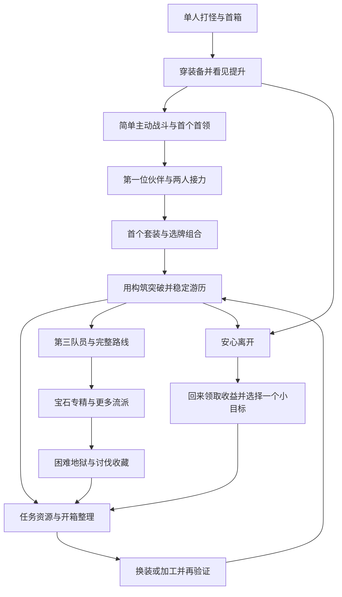

# 【待重整】《霞客行》玩家体验与渐进解锁旧稿

日期：2026-09-15  
状态：v1已因玩法边界混淆停止作为执行依据；未修改运行时、关卡、掉落和存档。  
依据：用户确认“构筑与开箱爽感”为继续游玩的核心；认可单主角起步、逐步加入伙伴与NPC的方向；结合[首轮试玩记录](2026-09-15-build-and-chest-play-review.md)。

**2026-09-15纠偏：**用户明确“挂机条是挂机条，局内是局内”。本文把挂机成长和局内卡牌教学串成了同一必经顺序，相关阶段、牌组、首领与奖励推导失效。渐进开放等原则保留供讨论，完整流程须按[挂机／局外／局内边界](2026-09-15-idle-inrun-boundary-correction.md)重新组织。

## 1. 要建立的体验

玩家的目标逐步从“拿到更好的东西”，变成“凑出一种打法”，最终变成“为自己的打法追求更好的东西”。

全程反复发生的小循环：

**看见一个可理解的目标 → 做一次有意义的选择 → 获得反馈与资源 → 调整队伍 → 用熟悉的玩法享受提升 → 产生下一个目标。**

新系统在这个循环之间出现。重大解锁、长剧情、批量领奖和强操作教学应错开。每次主要增加一个理解重点，然后安排至少一个可以实际使用它的完整循环。

### 已确认方向与本稿建议

- 已确认方向：构筑＋开箱；任务提供大量资源；开局足够简单；单主角逐步发展为伙伴和NPC加入。
- 本稿具体建议：阶段顺序、入门牌与入门赠箱、基础离线收益前置、首伙伴示范方式、界面开放范围、奖励调度与体验验收。
- 阶段编号不等于角色等级或正式关卡编号。下文分钟数是新手测试用的初始节奏目标，不能直接写成倒计时解锁或已验证结论。
- 当前正式三人编队、8＋5＋3卡组、工具默认全开等规则仍然有效。本稿提出的是下一版体验目标。

原P0～P3细化稿[已撤回](2026-09-15-first-boss-cards-and-rewards.md)，不得沿用其中的三牌、首领或奖励表。

## 2. 总体结构

第一轮连续游玩的重点是做出一个小构筑并获得回报。后续系统可跨会话出现；允许玩家在首箱和首次配装后就离开。

## 3. 开局前半段：从看懂到第一次主动选择

### P0：我知道现在发生了什么

**玩家心理：**“这个人会自己打怪，我等它打完能得到东西。”

- 画面主体：一名主角、一只敌人、清楚的生命变化，以及一个当前目标。
- 普通攻击自动进行；首次遭遇使用独立入门配置，保证很快出现可见进展。
- 当前目标只要求击败眼前敌人。开场身份和旅途动机用一句话即可，完整剧情稍后进入。
- 首次胜利保证获得一份入门赠箱，箱子进入清楚可点击的位置。
- 可见操作集中在领取/开箱。退出、静音、设置始终容易找到；必要帮助随时可用。
- 首次启动目标：约一分钟内接触第一次箱子，而不是先完成全界面浏览。

**本阶段不安排：**三人属性、职业选择、完整任务树、制作工具、宝石、遗物和多种货币说明。

**完成信号：**首箱实际打开。看过一条说明不等于完成。

### P1：开出来的东西让我变强了

**玩家心理：**“我刚拿到的这把武器有用。”

- 首份固定奖励给当前等级可穿、部位明确的武器。用现有新档物资拆分预算，避免与原六件初始装备重复发放。
- 打开背包时只突出角色、武器位、该装备与穿戴操作；装备比较先突出本次真正变化的属性。
- 玩家亲自完成穿戴。随后遇到同一种敌人，直观看到击杀效率改善。
- 可用的调试目标是同类怪由3次攻击变为2次；具体血量/武器数值需要用真实公式校准。仅面板增加一点、击杀节奏完全不变时，首轮反馈不够清楚。
- 给一小段自由打怪、拿箱、换装时间，先享受刚得到的提升。
- 首次装备目标：约两分钟内完成。设备加载与阅读差异需在测试中单独记录。

**完成信号：**有效穿戴且至少完成一次后续遭遇。

**可离开节点：**这时就可以安全保存退出。建议基础离线收益从开局可用，后续天赋提高效率和时长；这是相对于当前离线天赋门槛的新增设计建议。

### P2：我开始比较两种收益

**玩家心理：**“攻击高一点，还是血量多一点，对现在更有用？”

- 随进程逐步发放剩余基础部位，开放简单的生命/攻击/防御比较。
- 第一次替换尽量是清楚的提升；下一次再给真实取舍，例如攻击与生存。
- 早期奖励来源只产出当前有用途的物品。固定入门赠箱与普通随机宝箱必须有明确区别，不暗改普通箱已公开的概率。
- 先让玩家知道“东西可以留着，也能给之后的角色使用”。暂时没有加工需求时，保留充足空间。
- 当前目标为走完一小段路，远处只预告一个首领，不同时铺出三难度和30个关卡。

**完成信号：**玩家完成一次装备替换或自主确认保留现有装备，并走完下一段遭遇。

**缓冲：**再开几次箱子、打几只熟悉的怪，不立即弹出新的系统教学。

### P3：第一次靠操作获得突破

**玩家心理：**“这个敌人将要攻击，我能决定这回合怎样打。”

- 仍是单主角与单敌人，开始接触简化的主动挑战。
- 入门手牌只包含约3种容易解释的正式基础动作，例如普通攻击、防护、较高费用的重击；共享气力仍沿用正式战斗原则，初期所有牌可采用0内力费用。
- 当前主角牌普遍同时包含减费、状态、弃牌、格挡等联动，不能把现有牌的真实效果藏起来充当简单牌。需要为入门内容单独核定清晰的牌表和成长接续。
- 一次主要学习“看意图并安排气力”。单一合法目标可以自动选择；第二个敌人出现后再教集火和选目标。
- 先安排一次可理解的练习，再打首个小首领。首领有一个清楚的危险节奏，例如蓄力之后重击。
- 首次失败可立即重试，保留已经得到的奖励；不能以必输关强制玩家等待或购买。
- 成功奖励是一批能继续用于装备成长的箱子，并预告将有同伴加入。

**完成信号：**赢得首个入门首领挑战。无需另考一次全部术语。

**初始节奏目标：**约5～10分钟看到第一次主动突破，具体以陌生玩家实测调整。

## 4. 开局后半段：从两人协作到第一套构筑

### P4：多一个人，让我有新的办法

**玩家心理：**“同伴能做我自己做不到的事。”

- 首领奖励结算完成，先给玩家一段查看和穿戴战利品的时间，再引出同伴。
- 解锁第二个真实出战位；加入一位有直接用途的伙伴。初稿优先考虑防护型伙伴，先展示“伙伴提供防护，主角进攻”的单一配合。
- 首伙伴最终使用哪一位，须与入门牌表一起核定；当前守卫和刀客的核心牌都有复合机制，不能仅凭职业名称假定新手易懂。
- 伙伴有可立即使用的基础配装和固定推荐牌组。加入后的第一场先保持单敌人，专门验证两人协作。
- 此时重点解释牌属于谁，以及气力由队伍共用。内力、更多技能和换人选择随后逐项引入。
- 再下一段加入两个敌人，展示先击败威胁目标的价值。
- 伙伴试用和第一次正式替换应有等级衔接，避免新队员落后数十级。新手赠送队员的入队等级或短期追赶规则需单独定表；已有角色成长记录保持。

**完成信号：**完成一次两人共同参与的战斗并获得奖励。

### P5：我知道自己想凑什么了

**玩家心理：**“再来一件这种装备，我就能多做一个动作。”

- 展示一个两件套目标，说明尽量直接关联刚学会的动作，例如满足一次条件后多抽一张牌。
- 第一份套装演示奖励应能与已拥有的物品形成有效两件套。用明确的固定赠礼提供教学保障，常规开箱继续保持随机。
- 玩家可以先领取这些物品、稍后配置；不能让一次随机掉落或某个特定套装成为整个功能解锁的唯一门槛。
- 在角色页显示当前套装件数、已经生效的档位，以及剩余可追求效果。
- 给玩家一场容易观察效果的战斗。触发时反馈关联穿戴者和套装，帮助玩家把“多抽一张”归因到自己的配置。
- 同阶段允许修改少量卡牌选择，例如从有限候选中替换一张；选择围绕当前打法，不一次展示完整36张主角池与全部职业机制。
- 演示完成后再提供第二条可选方向，并逐步开放更多职业卡。

**完成信号：**玩家经历过一次真实组合收益；对追求快速进度的熟练玩家，也可由等价挑战进度提供后续入口，不设置反复考试。

**初始节奏目标：**首次连续会话约15～30分钟接触第一套有明确用途的小构筑。该目标与真实操作速度、奖励节奏一起校准。

### P6：我能决定金币用在哪里

**玩家心理：**“这笔奖励可以补装备，也可以让以后收得更多。”

- 两件套方向明确后，介绍定向套装包的用途，清楚写明随机一个部位。
- 10万任务金币继续支撑一次有意义的购买。避免刚发大额金币就同时要求支付多个系统解锁费。
- 天赋先介绍与眼前目标有关的一小段，例如提高战斗能力或提高稳定收益；完整四分支逐步展开。
- 一次只比较一个明确取舍。购买后安排一轮熟悉内容，让玩家看到投入的结果。
- 解锁条件优先依赖已发生的体验；若使用金币门槛，当前可获奖励必须足够支付，且不能阻断该金币唯一的获取来源。
- 进入可稳定刷取的地点后提示它适合游历，将“主动打过”转成“以后持续获得资源”的回报。

**完成信号：**进行一次自主投资，完成一次后续战斗或收益领取。

## 5. 中期扩展：需求出现后开放相应系统

以下分支可穿插在后续会话中。玩家的实际需求决定先后，多个条件同时满足时避免同时弹出教学。

### P7：我有多余的东西，怎样继续利用

**玩家心理：**“重复物也能帮我接近目标。”

- 出现明确替换下来的装备时，先介绍存放和锁定，再提供分解入口。
- 仓库在需要保存另一套装备时出现；基础空间须能承接一整批已承诺奖励，不能先靠满包打断开箱再强迫购买扩容。
- 分解第一次只处理玩家明确选定的闲置物，不自动选择穿戴物、锁定物或潜在套装关键件。
- 强化在玩家已经决定保留一件常用装备时介绍；第一次操作保证材料足够并有可见收益，不连续教学分解、强化、洗炼、镶嵌。
- 九合一在拥有足够同品质闲置输入后再突出介绍；允许混合种类的宝石合成等细节放到相应功能出现时说明。
- 当前九合一高品质可能不升阶且消耗全部输入，必须提前展示真实结果分布。合成让重复物回到追求中，不能包装成每次必然升级。

**满足感：**原本闲置的东西变成材料或新的机会，背包恢复清爽，玩家愿意继续开箱。

### P8：我想带一个能补足队伍的人

**玩家心理：**“我已经有输出和基本防护，现在需要另一种配合。”

- 在两人队伍和至少一种构筑方向稳定后，结合后续章节里程碑开放第三出战位。
- 叙事角色可以更早出现和说话；叙事登场与战斗槽位解锁分别处理。现有对白和美术不因槽位改造自动重写。
- 第三位NPC先以“能补什么”介绍，再展开双职业机制和三张牌的详细关系。
- 三人加入后先使用熟悉敌人验证新队员，随后再加入更复杂的敌方组合。
- 更换伙伴/NPC的完整候选页与职业课程在玩家需要尝试其他打法时可访问；课程作为可选练习并保留首通奖励。
- 成熟队伍仍回到主角8＋伙伴5＋NPC3的目标规模。前期规模需有明确的逐阶段配置规则。

**完成信号：**玩家能按一个具体需求选择或使用第三位成员，例如保护、治疗、蓄力配合或法术任务。

### P9：一趟挑战里，我还能临时把打法做大

**玩家心理：**“这条路线和这件遗物，会让我的队伍更适合这一局。”

- 正式路线逐步增加节点类型：先战斗与恢复，再加入选路、临时强化和遗物；行商与行旅钱最后加入这组教学。
- 各种节点分散在不同次遭遇之间，不在一张开局图上同时解释全部图例。
- 首次临时奖励只要求选择一个直接收益；第一件遗物清楚写出使用范围和持续时间。
- 战后局内奖励与整关永久收益分开说明，让玩家知道卡牌临时升级、遗物与永久装备分别保留到哪里。
- 行旅钱在首次使用行商时说明，并给足一次交易机会；其来源和消耗沿用统一规则。
- 正式流程仍保持挑战、游历与剧情专属战斗的独立进度，避免一次胜利让玩家不知道自己完成了哪类目标。

**满足感：**永久构筑提供起点，路线选择与遗物把这一局的打法进一步展开。

### P10：我想专门强化这套打法

**玩家心理：**“这件装备准备长期用，我要让它更适合我的队伍。”

- 在玩家已经形成一套打法后，开放宝石与镶嵌；先处理一次属性明确的镶嵌，再逐步展示14类完整专精。
- 镶嵌演示赠礼提供等级可用、有孔的装备和适配宝石；玩家已拥有合适装备时，奖励可补缺，但规则应预先明确。
- 先展示镶嵌后的实际属性或对应技能收益，边际计算细节留在详细说明里。
- 洗炼在玩家知道自己希望获得哪类词缀之后介绍。第一次清楚比较原属性和新属性，保留原版的选择始终明确。
- 此时完整属性、来源说明、套装混搭、职业课程和更大卡池应当可查，满足愿意深入研究的玩家。
- 常规宝箱全面产出宝石和相关材料前，应保证这些物品已有可理解的用途与存放位置。

**满足感：**玩家开始主动说出“我要雷击、我要护甲、我要持续伤害”，而不是被一串百分比要求做选择。

## 6. 后期：自定目标与长线收藏

### P11：我带着自己的打法去验证

- 普通、困难、地狱的推进使用更丰富的意图、阶段和资源压力；每次教学聚焦一个新增压力。
- 失败后帮助玩家区分生存不足、关键目标未处理、资源衔接问题或等级/装备差距，给出可执行的下一步。
- 玩家可选择改牌、换人、换装、强化或回到稳定地点游历。可行路径应有真实收益，不能所有失败最后都只剩等待。
- 自动战斗适合重复内容；主动操作仍应有改变结果或提高效率的空间。具体差距需实际构筑对照验证。
- 已经掌握的知识可以继续生效，避免每个新难度推翻前期规则。

### P12：我有一个长期愿意追的目标

- 对应难度3-3完成后，接入现有讨伐门票和3-4内容，明确三章连续挑战、成功耗票与讨伐箱的关系。
- 第一枚票与第一次可参加讨伐之间不再叠加多个陌生解锁条件。
- 三章挑战前两段保留队伍伤势、遗物与局内成长，最后结算提供清楚的整趟回报。
- 长期追求可包括提高目标套装品质、尝试第二个职业组合、优化宝石与词缀、提高讨伐稳定性和收集极稀有品质。
- 主体内容完成、稳定通过讨伐、终极品质收藏应各有清楚完成点，避免用全队顶级装备作为唯一的满足条件。
- 用户已批准的顶级装备1～2年目标作为收藏长线参考；本稿不修改该概率和时间预算，也不把旧模拟当作所有玩家的实际进度。

## 7. 每次回来的完整体验

建议的普通回访节奏：

1. **看成果：**领取本次金币、经验和宝箱，突出有用变化。
2. **开一批：**快速打开箱子，查看这批最高品质、新部位与可能形成的组合。
3. **做一个决定：**换一件装备、强化一个部位、尝试一张牌，或保留资源追下一件。
4. **验证一次：**打一个新目标，或者观察熟悉关卡效率提高。
5. **留下一个目标：**继续刷什么、缺什么、下一次回来想做什么。
6. **安心离开：**保存完成，知道离线收益会如何累计。

短会话做到前三步就有价值。想长玩的玩家可以继续走挑战路线，或主动研究第二套构筑。

### 没开到需要的东西时

- 显示距离下一次合成、强化或定向购买还差多少，提供可积累进展。
- 不制造不真实的保底或“快出货”暗示。若要新增保底，必须另行设计并公开规则。
- 第一套教学构筑用固定奖励确保能体验；后续收藏的随机性保留。

### 一次获得很多奖励时

- 箱子与库存支持安全承接或明确暂存，不吞奖励、不要求先丢掉物品才能理解新功能。
- 总览先回答“得到了什么”，再提供排序、存放和处理入口。
- 分解、合成、洗炼不在领奖时自动执行，避免将惊喜瞬间变成一组不可逆决定。

### 连续失败时

- 优先给一个能直接尝试的原因和行动，避免同时弹出装备、天赋、宝石、换人的全部建议。
- 入门失败可重试且不消耗稀缺门票；后期讨伐沿用失败/退出保票规则。
- 若当前只能等待，游戏应能说明等待哪一种资源、预计积累目标是什么；正式时间估算需使用真实收益而非虚构承诺。

## 8. 任务、奖励与解锁如何一起工作

### 8.1 奖励预算

- 保留现有任务大额金币/宝箱服务构筑的职责。暂不以渐进解锁为理由降低任务总奖励。
- 开局固定装备赠礼优先使用现有新档物资预算重新安排；额外补齐套装或镶嵌演示的奖励单列，不凭空重复原剧情报酬。
- 入门目标与现有剧情事件若不相同，不能把“装备成功”冒充“读完剧情”或直接写入剧情完成。两个流程使用各自进度和明确奖励凭据。
- 现有剧情节点可以从一个“当前目标”入口进入，完整章节树稍后开放；已完成与已领奖状态保持一致。
- 发完一批资源后，玩家应能使用已经开放的购买或成长入口。解锁费、首次操作费与演示赠礼一起计算购买力。

### 8.2 奖励分类与早期物品用途

| 奖励阶段 | 主要内容 | 开放前的处理 |
|---|---|---|
| 最初赠箱 | 可直接穿戴的基础装备 | 明确为固定赠礼 |
| 初次构筑赠礼 | 与现有装备兼容的套装部位 | 不依赖反复随机才可继续 |
| 常规开箱 | 正常装备、宝石、材料与门票规则 | 在对应用途可见后成为常驻产出来源 |
| 加工/镶嵌演示 | 足量材料、可用输入、一次完整成果 | 领取与处理都可中断后继续 |
| 章节/讨伐结算 | 大批箱子与长期资源 | 展示批次收获，并安全入库或暂存 |

不能隐藏尚未解锁的掉落物、偷偷转换成低价值物品或让它占满背包却不给解释。若早期需要独立随机箱，其名称、内容范围和概率必须与常规箱分开记录。

### 8.3 解锁调度

- 使用“已发生的实际行为＋进度里程碑”作为主要条件，等级与金币只作必要补充。
- 自然行为可满足条件；不要求必须先进入教程窗口再把同一操作做一遍。
- 多项条件同时满足时，最多主动介绍一项。其他已满足条件的功能可安静地显示可用入口，熟练玩家能主动探索。
- 正在战斗、选牌、领取奖励、携带物品或处理洗炼结果时，不插入抢焦点的解锁弹窗。
- 玩家关闭提示、退出游戏或读档后可以继续；不能因丢失赠礼、满包或重复回调造成卡关和重领奖。
- 固定展示下一项最相关的目标，避免所有未开放功能同时挂锁和红点。

## 9. 界面开放与教学粒度

| 阶段 | 主要界面 | 教学重点 |
|---|---|---|
| P0～P1 | 单人挂机、首箱、简化背包 | 开箱与穿戴 |
| P2～P3 | 属性比较、简短进度、单人战斗 | 一次取舍、意图与气力 |
| P4～P5 | 双人队伍、当前角色卡组、套装进度 | 一个跨角色配合、一个套装效果 |
| P6～P7 | 当前任务、定向商店、天赋小分支、仓库与所需工具 | 金币用途、重复物处理 |
| P8～P10 | 完整编队、章节树、路线、遗物、宝石与深度工具 | 按需要进入的专题 |
| P11～P12 | 成熟工作台、完整难度与讨伐 | 自定目标与优化 |

已生效的机制必须如实说明。简化应来自当时可用的内容和操作数量，不能通过省略真实费用、危险效果、概率或重要条件来实现。

现有23步界面入门可拆成独立短段落，随系统开放触发；保留完整回看和重学入口。13门角色课程继续作为可选练习，选择某职业时展示相关课程，不要求新玩家先读完所有角色。

## 10. 新旧存档与现行规则的边界

本稿需要后续明确改变的现行规则：

1. 当前有效队伍固定主角＋伙伴＋NPC，需扩展为真实1→2→3人；挂机、挑战、奖励、经验、目标与保存都需支持。
2. 当前主角固定选8张、起始牌组至少8张，需定义前期小牌组与成熟8＋5＋3的接续；不能只减少显示手牌而留下不可解释的完整牌库。
3. 当前工具默认五种开放，本稿改为新档渐进可用；工具收益天赋和工具功能入口不能混成一个状态。
4. 当前离线收益需要相应天赋，本稿建议基础离线前置、天赋用于进一步成长。
5. 当前普通1-1默认可游历；建议为入门流程使用独立身份，完成后接现有正式体系，保留原27关与3讨伐的稳定ID。
6. 当前普通/高级箱有完整产出范围，入门赠箱需独立标识与奖励账本，保持公开概率真实。

实施时：老档保留已经拥有和可使用的队员、装备、功能、卡组及进度，不重新锁回单人；已领课程/剧情奖励不重发。NPC永久拥有记录与叙事进度保持，第三出战位解锁不引入“路线结束自动移除NPC”的旧机制。

所有界面和验证仍在`/Game/GameXXK/Maps/L_DesktopTrainingHUD`的纯2D流程内。默认地图、已确认美术和现行战斗规则不在本轮设计写入范围。

## 11. 如何验证这条体验真的有效

### 新玩家观察

请没有读过设计案的人从新档开始，观察实际操作，不在旁边解释所有规则。首轮记录：

- 何时知道眼前目标，何时第一次打开箱子、第一次装备、第一次主动挑战。
- 穿戴后的战斗差异是否看得出来；玩家是否知道哪项选择造成了变化。
- 第一次两人配合和第一次套装触发能否被识别。
- 一批箱子结束后，能否指出一件想使用或保留的物品。
- 在哪一步开始迷路、反复切页、停住阅读，或认为没有可做的事。
- 第一次主动停止时，是否知道回来之后想追什么。

访谈在合适停点进行，不把游戏过程变成连续问答。前期分钟目标以这些观察校准。

### 关键体验检查

1. 首箱不会被教程目录、长剧情或付费门槛挡住。
2. 首件装备能够直接使用，并让至少一项实际表现发生明显变化。
3. 第一套教学构筑不受随机缺件、等级不够、没有孔或材料不足阻断。
4. 伙伴加入、敌人增加、新状态和新资源分开介绍。
5. 大额奖励有现成用途，不能领完后只面对多个未开放按钮。
6. 多次开箱都有可累积的去向，重复物处理不吞掉整段游玩时间。
7. 退出不会导致入门进度丢失、重复发奖或基础离线收益意外缺失。
8. 玩家能通过操作与构筑获得突破，也可以选择稳定游历后再来。

### 实现验证边界

设计定稿后，1/2/3人编队、小牌组、奖励与存档属于运行时行为改动，需按项目规则进行冷UBT与针对性的行为验证。当前只完成文档校验，没有启动编辑器或声称这些新流程已实现。

## 12. 建议落地顺序与待定细节

### 顺序

1. **先闭合P0～P3：**单人单怪、首箱、穿戴、简单主动战斗与首领。先做一次真正的新玩家观察。
2. **再闭合P4～P6：**首伙伴、一次合作、首个套装、一次金币投资，再观察玩家是否愿意主动继续。
3. **接入P7～P10：**按需求开放加工、第三队员、路线与专精，补齐分阶段奖励范围。
4. **最后串P11～P12与回访：**正式难度、讨伐、长期收藏和跨会话进度；校准早中后期预算。

### 定数值前要确定

- 入门基础牌与首伙伴示范牌具体是哪几张，以及如何接回成熟牌池。
- 首领、第二槽、第三槽与现有正式关卡/剧情的对应里程碑。
- 入门赠礼、套装补齐、镶嵌演示分别使用多少既有物资与额外预算。
- 基础离线前置的时长/效率，以及现有离线天赋的作用调整。
- 商店等级、合成等级、箱子来源等级在渐进流程中的一致说明。

这些是下一步定稿项目，不妨碍当前完整体验顺序成立；本稿不以未经验证的具体等级和掉率替代它们。
