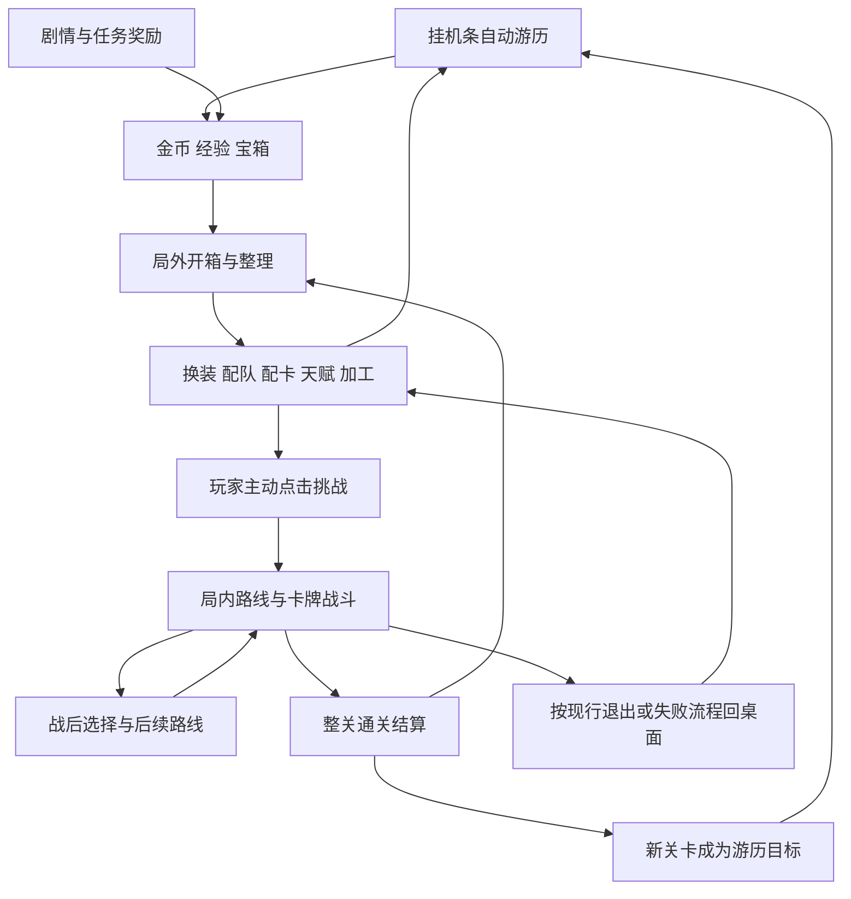

# 《霞客行》三层玩家流程梳理 v2

> 历史讨论稿。完整学习路线现见[渐进学习计划](2026-09-15-full-onboarding-learning-plan.md)，已实现规则见[出战槽与主线验收](../production/2026-09-15-party-slot-onboarding.md)。本稿中“挂机整轮开放伙伴”“土司首先入队”“槽位免费”等旧候选已被后续用户决定替代，不可据此实施。

日期：2026-09-15。状态：设计分析稿；本轮只整理文档。  
本稿承接[挂机条与局内边界纠偏](2026-09-15-idle-inrun-boundary-correction.md)，取代旧单线新手草稿作为本轮讨论入口。

**用户随后明确的规则：**新档只有主角，伙伴和NPC槽位后续逐步解锁；解锁后可以卸下伙伴或NPC，并按实际编队进入局内。该规则已确认，下面的具体解锁里程碑仍为建议；代码尚未实施。

**用户最新明确决定：挑战期间暂停挂机。** 此决定取代前面的“挑战期间游历继续”表述，并行运行方案已撤回。其他候选解锁节点仍未逐项定稿，挑战与挂机的衔接见第2.1节。

## 1. 定位与现行边界

用户确认的核心乐趣是构筑和开箱，任务的大量金币与宝箱用于支持这两个目标。

三个部分各自承担不同职责：

| 部分 | 玩家正在做什么 | 收益与体验 |
|---|---|---|
| 挂机条 | 自动游历、看进度、积累资源 | 持续成长与等待收获 |
| 局外工作台 | 任务领奖、开箱、装备、编队、配卡、天赋、工具、商店 | 使用资源、形成自己的配置 |
| 局内挑战 | 选择路线、卡牌战斗、选临时奖励和遗物、处理事件及行商 | 验证配置、做本局选择、突破关卡 |

高层成长循环：

**挂机／任务产资源 → 局外开箱与构筑 → 主动挑战 → 通关并获得新的游历目标 → 返回挂机与养成。**

这个循环可以很快走一遍，也可以在挂机与养成之间停留多次。玩家决定何时进入局内。

### 已核对的当前规则

- 新档普通1-1默认已通关且自动游历。
- 普通游历一轮包括4组普通、2组精英和1组首领遭遇；都由挂机规则自动处理。
- 普通挑战先进入现有路线图，玩家选择节点后进入全屏卡牌战斗。
- 当前源码会在普通挑战期间暂停游历，与用户最新决定一致。局内“自动战斗”执行卡牌操作，路线、事件、商店与奖励仍由玩家选择。
- 普通挑战整关成功后登记通关，并将成功关卡设为新的游历目标。
- 剧情专属战斗从对白直接进入，胜利继续剧情和奖励；不按普通挑战清关记账。
- 教程课程属于独立借用教学战斗。
- 当前两种玩法共用永久角色、装备、等级和编队等数据；运行过程分别维护。

以下解锁与呈现为建议，不能与以上当前行为混写。

## 2. 三条体验线的连接图

挂机条的首领仍然属于挂机一轮中的遭遇。局内普通战胜利、局内整关首领结算、剧情战胜利各有不同的后续动作。

### 2.1 挑战期间暂停挂机（最新决定）

**已确认的规则：进入挑战后暂停挂机，离开挑战后恢复挂机。** 此处挂机即游历，前述并行运行、同期挂机升级与并行讨伐门票方案不再继续设计。

- 暂停覆盖同一次挑战的路线、卡牌战斗、事件、商店和奖励选择阶段，直到结束挑战返回桌面；不能仅战斗时停、切到路线图又自动开始挂机。
- 挑战中的金币、经验和奖励按挑战规则结算，该时段不同时产生挂机收益。
- 挑战前已经获得的挂机收入与物品保留；暂停时间不应在返回或读档时被误算为另一段挂机收益。
- 普通挑战通关后，仍按既有流程将通关关卡设为新的游历目标并恢复挂机；取消或失败返回遵循现有可用地点与结算规则。
- “恢复挂机”不额外承诺保存到原受击帧或原波次；遭遇重新初始化、血量与冷却的具体恢复方式沿现有规则核对，本次没有确认另一套恢复机制。
- 真实关闭游戏后的离线资格与收益区间另按既有规则处理，不把在线挑战时长冒充离线时长。

后续人数改造时一并回归：挑战期间无Travel步进与挂机产出、离开后恢复、已有收益不丢失、暂停时长不重复补算。

## 3. 第一条线：挂机条怎样让人愿意继续看、继续收

### A0 初见：我知道它在做什么

- 新档实际出战仅主角；建议第一眼聚焦一个当前敌人、生命变化与当前游历进度。
- 伙伴和NPC槽位后续逐步解锁并可留空，挂机使用共享编队中的实际出战成员；早期单敌与后续敌人数量另行定表。
- 第一条目标与挂机本身相关，例如完成眼前遭遇并拿到首份收获。
- 设置、静音和退出始终可达，其余功能随需要介绍。

玩家此时应理解：“角色会自己前进和战斗，完成遭遇会有收益。”

### A1 首份收获：我想打开这个箱子

- 首次箱子出现的位置与点击方式清楚。若用固定新手赠礼保证第一次体验，应独立标明，不能将其冒充普通箱的随机结果。
- 打开后突出本次获得的物品，给出进入背包的短路径。
- 新手赠礼优先给当前可用的装备；具体品类、数量和来源预算待奖励表核定，不沿用已撤回的六箱安排。
- 尚未介绍的物品要有安全保留方式与真实说明；是否另做入门奖励池是独立设计项，不能偷偷删除或转换实际掉落。

玩家此时应理解：“箱子里的东西归我了，而且可以用。”

### A2 第一次成长：这件东西对挂机有帮助

- 玩家在局外穿戴装备；回看挂机条时仍然是自动游历。
- 选择当前演算确实使用的属性验证反馈，例如攻击影响击杀效率、生命影响生存；不要拿局内护甲牌或回合气力解释挂机。
- 比较尽量在同关卡、同类遭遇下进行，并区分装备与角色升级带来的变化。
- 完成一次提升后，留几轮熟悉的自动遭遇，让玩家观察和享受成长。

### A3 看懂一轮：我知道进度条为何回到起点

- 清楚表达普通、精英、首领是本轮遭遇的推进。
- 挂机首领自动结算；一轮结束后继续该地点游历。
- 本轮游历完成不等于挑战首次通关，也不自动取得下一关的通关记录。
- 第一轮结束适合介绍挂机的循环性和失败重试。若将其用于伙伴槽等新手里程碑，要明确记录“完成游历轮次”，而不是复用普通挑战首通。

### A4 自主挂机：我想选一个合适的地方刷

- 取得更多通关记录后，玩家可选择已可游历地点。
- 浏览关卡与点击“游历”分别表达，查看别的关卡不应让玩家误以为已经切换。
- 玩家会权衡更高单次收益、实际击杀速度与失败情况。是否刷高关应看真实收益，不能只看关卡编号。
- 重试开关、当前目标和必要收益说明集中在相关位置。

成熟挂机小循环为：

**选可游历地点 → 自动积累 → 收箱开箱 → 局外调整 → 回看效率 → 继续。**

## 4. 第二条线：局外怎样把奖励变成构筑

### B0 背包：先完成一次真实使用

- 首箱后聚焦一次穿戴，显示真实属性变化。
- 新手先查看当前角色；其他角色和完整比较工具随着编队需求出现。
- 首次引导以实际操作结束。其余属性、详细说明可主动查看，不要求先浏览所有页。

### B1 任务：持续提供有用途的资源

- 首次开箱与穿戴形成概念后，可以介绍当前可进行的任务。
- 默认突出一条当前任务及报酬；完整章节树和支线回看可随后展开。
- 现有对白、调查、剧情专属战斗与奖励条件保留各自身份。简化入口不代表自动完成剧情。
- 任务的大额金币和箱子继续承担资源补给：一批任务奖励给玩家多次开箱、购买和调整的机会。
- 领取后优先看收获，再由玩家选择开箱或继续任务。不要同时启动多个新系统教学。

### B2 开箱：从获得物品到发现机会

- 单开重在看清一件物品，批开重在快速看清一批收获。
- 建议摘要突出数量、最高品质、新部位和可能形成的套装；同时保留快速继续开箱的操作。
- 玩家能从收获返回配装，查看“谁能用、哪件能换、还缺哪个部位”。
- 当前未适配的物品可以保存，重复物逐渐引出仓库与工具需求。
- 教学用固定赠礼与正常随机箱分开；一次随机未出货不应阻断必要的新手教学。

### B3 装备与套装：先出现一个具体目标

- 有一件套装装备时，让玩家知道再凑一个不同部位可能得到什么效果。
- 两件套效果使用当前真实规则，穿戴件数与已激活档位清楚显示。
- 套装偏向局内的效果，在介绍时标明作用场景。不能让玩家期待它在挂机条里自动执行同样的抽牌或反击链。
- 首次演示成功后，允许玩家继续收集、尝试混搭或选择其他方向。

### B4 编队与卡组：围绕想解决的问题调整

- 按第8节已确认的可空槽规则，逐步解锁伙伴和NPC出战位，介绍新角色的具体作用及配置入口。
- 推荐配置让第一次尝试能进行；主动编辑继续使用现有合法牌组规则。
- 先帮助玩家读懂当前使用的牌和一个可尝试的配合，再展开更多职业说明。
- 各角色携带份额沿用主角8、伙伴5、NPC3；只有实际出战成员的牌进入本次起始配置，形成8/13/11/16张四种基础组合。首领牌和局内临时牌另按既有规则处理。新增三张简化牌的旧建议保持撤回。
- 剧情角色登场、永久拥有角色、出战槽可用是不同事件，应避免一次出场直接承担全部教学。

### B5 商店与天赋：金币有明确的去向

- 有套装目标后介绍定向装备包，说明随机部位；有开箱需求后介绍箱子购买。
- 保持任务奖励与当前购买力的联系，具体价格沿用当前规则，待完整预算评估再讨论数值。
- 天赋第一次聚焦一个眼前有用的收益：战斗成长、容量或资源收益均可，避免逐项讲完整四分支。
- 引导可以推荐，玩家仍可主动查看其他选项。
- 新功能解锁若需金币，要核对当前可获得预算，避免获得报酬后先交多个解锁费，剩余资源不足以体验功能。

### B6 仓库与五种工具：需要出现时再学

| 需求 | 介绍的功能 | 一次完整体验 |
|---|---|---|
| 想留另一套装备，背包开始需要整理 | 仓库、锁定 | 存放与取回一件物品 |
| 有明确闲置装备 | 分解 | 选择闲置物，确认所得材料/金币 |
| 有准备继续使用的装备和材料 | 强化 | 看消耗与规则，操作后核对真实变化 |
| 已有足够同品质闲置输入 | 合成 | 查看真实概率，完成一次合成并处理结果 |
| 有可用孔位和适配宝石 | 镶嵌 | 装入宝石，查看其实际作用 |
| 已知道期望的词缀方向 | 洗炼 | 比较新旧结果，自主保留或替换 |

这些是按需求出现的教学，不是一口气学完五工具的必经课。具体功能解锁是新的设计项，当前运行时仍为五工具默认可用。

大批奖励必须有承接空间或明确暂存，不把强迫清包当作首次分解教学。锁定物、穿戴物和潜在套装关键件不能被引导自动处理。

### B7 准备离开与回来

- 离开前清楚说明保存结果与当前离线收益资格和上限。
- 当前离线收益有天赋前置，本稿如实说明该前置；是否前置基础离线收益另行决定。
- 回来后先展示本次实际收益，再让玩家开箱和选择下一步，不连续弹出任务、升级、解锁、教程等多张窗口。

## 5. 第三条线：局内怎样承接已有构筑

### C0 动机：我想试试这套配置

- 玩家在局外已理解装备和基本配置后，看到一个具体可挑战目标，以及通关后带来的游历进度价值。
- 挑战由玩家主动点击进入，不能由挂机首领演出自动切换过去。
- 进入挑战后挂机暂停，玩家在本次路线中专注挑战；结束返回后恢复游历积累。
- 首次局内可以由单主角进入。此时使用主角现有8张配置，伙伴/NPC未出战时不加入其牌、属性或触发效果；不要求先解锁或填满三人。

### C1 进入：我知道接下来要选什么

- 普通挑战进入现有路线图，先说明当前可选节点和终点。
- 当前可走的节点优先清楚；其他图例可以在到达时解释或通过悬停查询。
- 不要求玩家在进入第一场战斗前理解所有遗物、事件和行商规则。

### C2 第一场卡牌战：学当前用得上的动作

- 使用实际进入挑战的合法队伍与现有卡牌，不额外制造三牌规则。
- 引导分成短段：选择一张可用牌、选择合法目标、观察支付与效果；然后理解结束回合与敌方意图。
- 共享气力、独立内力和角色归属，在当前动作涉及到时分别解释。
- 教学不省略真实费用与危险条件；详细卡文与关键词继续可查。
- 现有角色课程可以作为可选练习，完成后回到原进度；不强制先学完13门课。

### C3 发现联动：我做的配置产生了效果

- 当已有套装、角色或卡牌组合实际触发时，指出本次变化来自哪里。
- 例如本轮试玩中的破军额外抽牌，是有效的效果说明案例；不能预先假设每个新档都已拥有同样装备。
- 玩家可手动操作，也可使用现有局内自动出牌观察配置表现；自动出牌不接管整条路线的所有选择。

### C4 战后选择：这一局还能继续成长

- 普通/精英战结束后的选项，围绕当时已有牌组提供可理解的选择。
- 首次出现临时牌品质提升或遗物时，说清它的作用范围和保留到何时。
- 选完后回路线，玩家自己决定后续节点。一次战斗胜利不冒充整关通关。

### C5 事件、恢复与行商：遇到时再认识

- 到恢复节点时，解释恢复选择与当前队伍状态。
- 到事件或宝匣时，展示这一次的选项及结果。
- 到行商时，解释当前实际使用的行旅钱及其局外来源；不沿用旧文档中的历史货币口径。
- 玩家逐渐理解如何经营一整趟路线，永久构筑与本局强化共同决定后续表现。

### C6 整关结果：我知道这趟获得了什么

- 成功：按当前结算显示永久奖励、通关和解锁，再返回桌面。
- 普通挑战成功关卡会成为新的游历目标，返回后应清楚显示地点变化。
- 结算保留挑战前已有的挂机收入；本次挑战时长不补发挂机奖励，返回时按既有规则恢复游历。
- 失败或主动退出：按现行结算边界说明结果，回到局外调整；不要把失去本局临时效果写成永久装备丢失。
- 第一次失败优先指出一个可尝试的方向，例如配置、生存或目标选择，避免同时推荐所有成长系统。

局内循环为：

**带着配置进入 → 选择路线 → 打牌与战后选择 → 经营本局资源 → 整关结果 → 回局外决定下一步。**

## 6. 三层串起来后，一次自然游玩的样子

| 阶段 | 挂机条 | 局外养成 | 局内与进度 |
|---|---|---|---|
| 新档 | 实际只有主角，自动游历；早期敌人数另定 | 首箱、首次穿戴、当前任务 | 不强制立即进入 |
| 单人成长 | 持续积累金币、经验和箱子 | 任务大额补给，开箱、换装、配置主角现有8张牌 | 玩家主动用单主角开始可挑战内容；剧情专属战斗仍走自己的入口与进度 |
| 伙伴槽解锁后 | 编入伙伴则两人游历，留空则继续单人 | 先认识一位伙伴及其用途，配置原有5张携带牌 | 按实际编队使用8或13张基础携带牌；槽位解锁不要求玩家必须上人 |
| NPC槽解锁后 | 跟随实际编队，可为单人、任一双人或三人 | 介绍一位NPC与现有队伍的配合 | 支持8/13/11/16张四种基础配置，伙伴可以卸下后只带NPC |
| 自主构筑 | 选择合适已通关地点稳定游历 | 按需求介绍天赋、定向购买、仓库、加工和宝石 | 在同一玩法框架中尝试不同人数、配牌和套装，通过正式挑战推进 |
| 长期追求 | 更高难度与满足门票条件的挂机讨伐 | 重复开箱、精炼目标配置、收藏另一套打法 | 正式高难和三章局内讨伐，成功后按规则回到成长循环 |

每次普通挑战整关成功都形成一个明确回报：结算、通关、新的游历目标。玩家可以先回桌面享受更好的积累和下一批开箱，也可以继续挑战；人数增加只是可用选择增加，不变成每次必须填满的要求。

伙伴和NPC的具体解锁节点见第8.2节候选。玩家可以多次停留在单人成长与开箱阶段，也可以在解锁后继续选择单人。心流来自目标、选择与反馈连续，表格不是强制点击顺序。

## 7. 后期与讨伐

- 普通、困难、地狱的推进继续由正式关卡规则控制。每次突破让局外成长有新的用途。
- 对应难度3-3首通的讨伐令，将玩家带到3-4的更长线目标。
- **局内讨伐：**三张连续路线、21组遭遇，前两章延续队伍伤势与本局构筑，末章完成总计结算。
- **挂机讨伐：**挂机条按对应21场完整循环运行，按照实际门票预算与收益规则结算。
- 两种讨伐共用门票、永久资源和相关关卡定义，但仍然分别进行挂机演算与局内卡牌/路线流程。
- 长期目标包括稳定通关、优化当前套装、第二套打法与高品质收藏；本稿不重设现有顶级品质概率。

## 8. 队伍渐进解锁与可空槽（用户已确认）

用户答复：“修改规则，先只有主角一个人，伙伴和npc槽位后续逐步解锁，后续编队进入局内也允许玩家卸下npc和伙伴”。此答复替代此前固定三人的设计前提。

### 8.1 合法编队

| 实际出战 | 前置 | 基础携带牌份额 |
|---|---|---:|
| 主角 | 新档即可 | 8 |
| 主角＋伙伴 | 伙伴槽已解锁并编入伙伴 | 8＋5＝13 |
| 主角＋NPC | NPC槽已解锁并编入NPC；伙伴可为空 | 8＋3＝11 |
| 主角＋伙伴＋NPC | 两槽已解锁且均编入 | 8＋5＋3＝16 |

- 主角为必需成员；伙伴与NPC各至多一位。
- 槽位解锁后可以留空，也可以再次编入；卸下伙伴不会重新锁住NPC槽。
- 卸下只改变出战，不删除角色、等级、装备、保存的个人卡组或槽位解锁记录。
- 挂机和进入局内时共用这份实际编队。空槽不参与攻击、承伤、经验、装备触发或牌组生成。
- 查看角色背包不等于改变编队；保留明确的编入/卸下操作。
- 按现有路线约束，在局外完成编队后进入局内；本次路线冻结入场队伍。用户此次允许空槽不自动扩大为战斗中随时换人。

### 8.2 建议解锁节奏（条件尚未最终确认）

**单主角挂机与局外成长 → 首次挂机整轮完成后开放伙伴槽 → 玩家选择单人或带伙伴挑战 → 第一章普通挑战收尾后开放NPC槽 → 自由选择单/双/三人打法。**

- 本轮细化调整了先前候选：伙伴槽建议改为首次正常挂机整轮完成后开放，而不是等单人打完首次普通挑战。理由是先让新手完成简单的挂机成长闭环，再获得可用于局内的配合选择。该触发条件仍属建议，尚未由用户逐项确认。
- 伙伴槽只开放出战资格，不自动切入局内，不强制加入角色。玩家在解锁之前也可以单主角进入合法挑战。
- NPC槽候选条件：完成普通第一章的挑战收尾（例如普通1-3）。
- 伙伴槽依据真实游历整轮结算，NPC槽依据对应普通挑战的真实通关。新档普通1-1默认通关标记不代替任一真实完成事件。
- 若正常离线收益结算中有符合条件的完整游历轮次，可在该收益实际提交后满足伙伴槽条件；不能将未结算的预估轮次当作完成。
- 剧情专属战斗与课程胜利不冒充普通挑战首通；如果后续要用剧情里程碑解锁，必须单独明确改用哪个事件。
- 这些条件是为组织讨论提出的候选，需要结合首批单人可玩内容校准；人数及空槽规则本身已经确定。

### 8.3 对初期关卡与成长的要求

- 第一批局内关卡必须能由单主角合法进入并完成；对应敌人编制、数值与现有主角牌需单独验证，不能搬用挂机演算的血量例算。
- 初稿建议关卡强度由关卡定义决定，后期卸下队员不自动让敌人按人数大幅缩水；避免通过临时卸人获取同等奖励的低难版本。是否需要其他平衡机制以后用四种编队对照决定。
- 单人牌库更集中、三人机制更多且多份独立生命/内力可用。两者都是需要实际验证的构筑取舍，不能提前承诺某种人数必然更强。
- 需要其他友方的效果在单人下必须准确预览并合法处理；不能创建虚拟队友、扣费后无反馈或自动改写玩家保存的选牌。
- 第一位新队员的等级、可穿装备与获得经验要能接上当前进度；追赶规则尚待定表。

### 8.4 存档与验收

- 区分槽位未解锁、已解锁但空着、已编入三种状态；保存和规范化不能把合法空槽当坏档，自动补回刀客或土司首领。
- 旧档保留原有出战名单和角色资产，已有功能正常可用，不锁回单人。
- 验证四种编队的游历、局内进出、奖励经验、失败返回和存读档；脱战与路线结算不得偷偷补人。
- 验证卡牌、反应和套装的所有者仅来自实际出战成员；局外未出战角色的永久配置仍保持。

## 8.5 本轮细化：开放资格、首次介绍与玩家选择

以下表格为具体候选，不代表全部已经批准或实现。人数可空槽与挑战期间暂停挂机两条用户确认规则保持。

| 内容 | 建议开放资格 | 第一次只介绍什么 | 玩家可以怎样选择 |
|---|---|---|---|
| 背包与装备 | 获得第一件可用物品 | 穿戴与属性变化 | 自由查看和穿戴其他已有物品 |
| 当前任务 | 完成首次开箱/穿戴的介绍后出现当前可进行任务 | 一个目标和对应报酬 | 继续任务或回到挂机；已有自然操作可跳过介绍 |
| 主角卡组与挑战入口 | 首次穿戴后即可查看，进入仍满足关卡资格 | 当前主角8张配置，以及挑战会暂停挂机 | 单人挑战、可选课程，或继续积累 |
| 伙伴槽 | 首次正常挂机整轮实际完成 | 一位伙伴能提供的配合 | 编入任一已拥有合法伙伴，或保持空槽 |
| 定向装备商店 | 已接触一件套装装备，或主动寻找装备来源 | 当前目标套装包的价格与随机部位 | 购买、继续随机开箱或攒钱 |
| 基础仓库 | 背包可用后即可安全存取 | 在有保存/整理需求时演示一次转移 | 保留未来构筑，不必立刻分解 |
| 强化 | 已穿戴装备且拥有可用强化材料 | 一件常用装备的成本和实际提升 | 现在强化或暂时保存材料；不要求先打赢挑战 |
| 分解 | 玩家已有明确替换下来的闲置装备 | 手动选一件，查看收益后确认 | 可以给伙伴、存仓或分解，系统不替玩家判废 |
| 合成 | 已持有足够的合法同品质闲置输入 | 九件投入、真实品质概率和产物 | 可直接进入，不强制先完成另一工具课程 |
| 天赋 | 首次装备成长后可访问 | 一个与当前需求相关的节点 | 自主投资能力、容量或收益；不逐个讲完整四分支 |
| NPC槽 | 普通第一章挑战收尾的真实通关 | 一位NPC怎样补足现有打法 | 可不带，也可卸下伙伴仅带NPC |
| 宝石镶嵌 | 候选为普通1-2真实通关后 | 一件有孔装备＋一颗适配宝石的完整操作 | 自主选择装备和宝石；实际投放需与第8.7节一起定稿 |
| 洗炼 | 已经理解一项装备词缀，且有可用洗炼砂 | 比较新旧属性并自主保留 | 不强制接受新词缀或重复付费 |

“开放资格”与“强制教学”分开：自然操作满足条件就记录，首次介绍可关闭或稍后重看。当前存在五工具默认全开的代码，本表中真正的进度门槛需要另行实施，不能只给按钮换一个锁图标。

### 8.6 首次编入队员的完整交互

1. 满足槽位条件后先完成当前收益或挑战结算，之后出现简短提示“伙伴位已开放”或“NPC位已开放”。
2. 玩家点“查看编队”才打开编队页；继续挂机或跳过提示均合法。
3. 显示一个推荐角色与简短用途，并保留查看其他已拥有角色的入口。推荐身份可先复用现有起始刀客、土司首领；这只是介绍顺序，不强制更改选择或重新招募已有角色。
4. 玩家明确点击编入后才改出战名单。默认读取该角色原有合法5张或3张配置；查看和取消不改编队。
5. 编队页提供卸下操作。卸下后槽位显示“空位”，不会在返回、读档或进入局内时自动补人。
6. 玩家亲自使用该角色的配合，或在既有课程中练习；不要刚选人就要求遍历所有职业牌与套装。

**等级衔接建议：**首次解锁每类槽位时，为首次实际编入的该类成员提供一次追赶资格，使其至少达到当时主角等级，保留更高的原等级、个人卡组和出生种子。每类槽位仅一次，卸下/重选/读档不重复给；后续其他成员维持现有成长规则。这是新增候选规则，尚待用户确认，不能与已确认的槽位规则混写。

等级追赶可能同时开放更多候选牌；保持原合法选牌，不强制重新配满一整页，不在入队瞬间连续弹出多个新牌提示。是否需要更广泛的替补成长机制，留待多编队实际体验后决定。

### 8.7 奖励、开放与制作的依赖检查

已经有明确解决方向的部分：

- 首次开箱可用一份明确的装备赠礼承载，把现有初始武器改为在首份赠礼中领取是候选方式；旧档已有物品不重复发。本稿不恢复已撤回的六箱固定流程。
- 任务大额金币与关键任务宝箱按各自现有完成条件领取，不用开箱/穿戴行为冒充剧情完成，也不额外再复制一笔10万金币。
- 第一位伙伴由挂机轮次开放，避免“想用伙伴通过第一次局内，却必须先通过该局才能得到伙伴”的门槛。
- 强化不依赖首次挑战胜利，让玩家在失败后有真实成长途径。
- 基础仓库在大批奖励到来前可用；收获先安全入库或暂存，避免先逼玩家分解才能继续领奖。
- 槽位建议由进度直接开放，不额外收解锁费；金币集中用于装备与成长。这也是本轮建议，不将历史聊天中的付费解锁例子视为必须实现的规则。

**仍必须单独定表的冲突：**现有普通/高级箱会产出宝石、材料和讨伐令，而镶嵌等功能拟延后出现。不能只锁镶嵌按钮，却让新玩家持续面对大量无法理解的宝石。

下一步需对照第一批任务奖励确定早期物品暴露方案：采用有明确名称/规则的早期装备奖励，还是保留完整随机箱并提前提供对应物品的简单存放与用途说明。任何变更都要保持概率真实、奖励来源可追溯，重新核对前期装备预算；本轮不直接修改成熟宝箱概率或用户已批准的品质长线。

### 8.8 单人首次局内的内容验收

- 使用现有主角8张合法配置；伙伴/NPC未出战时，其牌和效果不进入局内。
- 分别检查普通挑战、剧情专属战斗与借用课程的入口，不将其中一个的胜利替代另一个的进度。
- 当前标准遭遇很多采用三敌编制；首批单人可玩性必须用正式战斗管线检查。可调整哪些早期遭遇属于后续内容设计，不用挂机伤害或先前撤回的三牌模型直接推定。
- 首次教学聚焦当前一张牌、一次目标与一次敌人意图，逐步解释已有规则；自动出牌继续可选，路线和奖励由玩家决定。
- 挑战的路线、事件、选奖励和战斗阶段都暂停挂机，返回后按现有规则恢复；这段在线挑战时间不能补算为离线收益。
- 新功能不是唯一获胜凭证：槽位已开但留空仍可进入合法内容；不能在后台强制凑三人。
- 通关结算说明实际奖励与新的游历地点，留出处理战利品的时间后再介绍下一项功能。

## 9. 后续定稿清单

1. 按第8节确认的单/双/三人规则，核定伙伴槽和NPC槽的具体解锁事件。
2. 定挂机开局的实际人物/遭遇范围及首箱触发，不修改局内牌表来解决挂机问题。
3. 定局外功能的首次介绍条件及必要的奖励承接空间。
4. 用现有合法队伍与卡牌设计首次局内短引导，分别验证手动与自动出牌路径。
5. 核对奖励、功能解锁和关卡进度之间无循环依赖；再做陌生玩家观察。
6. 按第2.1节核对挑战期间暂停与返回恢复，避免人数改造破坏当前互斥及结算边界。

验收关注：能否看懂挂机、能否使用首次收获、能否从一批箱子里发现目标、是否理解主动挑战的价值、能否看懂整关结果，以及回来以后是否知道继续追什么。

## 10. 依据与验证范围

- [本轮实际试玩](2026-09-15-build-and-chest-play-review.md)
- [玩法边界纠偏](2026-09-15-idle-inrun-boundary-correction.md)
- [当前Training规则](../../Source/GameXXK/Private/GameXXKTrainingRules.cpp)
- [当前MVP流程与共享状态](../../Source/GameXXK/Private/MVP/GameXXKMVPSubsystem.cpp)
- [剧情专属战斗](../production/2026-09-12-story-direct-battle.md)
- [讨伐规则合同](2026-09-10-hunt-stage-design/runtime-contract.md)（实现状态以更新的验收记录为准）

本轮完成文档与源码边界核对，未继续试玩，没有修改运行时、卡牌、怪物、掉落或存档。
