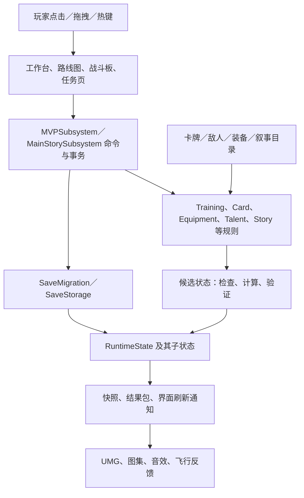
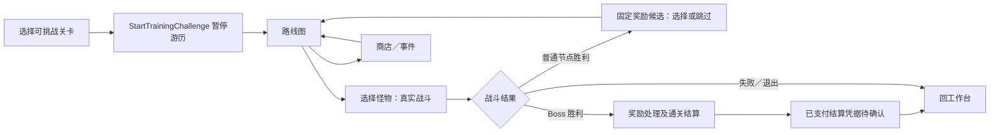

# 《霞客行》程序交接：整体框架、架构与表现逻辑

日期：2026-09-16。阅读入口：[交接包](README.md)；产品意图：[玩法案](02-gameplay-design.md)；未完成范围：[待办表](03-backlog-and-acceptance.md)。

## 1. 项目是什么，程序要接手什么

《霞客行》是 UE 5.8 实现的桌面挂机与队伍卡牌构筑游戏。玩家在桌面游历获得资源，在背包、工具、天赋、编队中成长；主动进入挑战，用共享手牌和气力完成路线战斗；主线任务提供剧情、角色接入和一批明显的金币、宝箱收益。

需要维护的核心关系是：**永久养成决定出战输入，战斗规则产生权威结果，界面按结果演出，结算把合法收益交回永久养成。** 游历、普通挑战、任务战共用部分角色和数值资源，但有不同的推进状态和奖励边界。

本项目不是已经彻底分层的框架模板。规则类已有较多拆分，`MVPSubsystem`、`CardRules`、`DesktopTrainingWorkbenchWidget`、`BattleBoardWidget` 仍承担大量职责。以下分层图表达现有责任和维护边界，不代表各层完全解耦。

## 2. 启动、模块与默认表面

| 范围 | 当前入口与职责 |
|---|---|
| 工程／引擎 | [GameXXK.uproject](../../GameXXK.uproject)，EngineAssociation 为 5.8 |
| 默认地图 | [DefaultEngine.ini](../../Config/DefaultEngine.ini)：编辑器与游戏默认 `/Game/GameXXK/Maps/L_DesktopTrainingHUD` |
| 启动及导航 | `AGameXXKMVPGameMode`、`AGameXXKMVPPlayerController`，在同一纯 2D 表面切换工作台、路线与全屏 BattleBoard |
| 运行时模块 | [GameXXK.Build.cs](../../Source/GameXXK/GameXXK.Build.cs)：UMG/Slate、Paper2D、JSON、输入；Win64 依赖桌面覆盖插件 |
| 平台窗口层 | [GameXXKDesktopOverlay](../../Plugins/GameXXKDesktopOverlay/Source/GameXXKDesktopOverlay/Public/IGameXXKDesktopOverlayModule.h)：Windows 桌面窗口／交换链相关能力 |
| 编辑器模块 | [GameXXKEditor.Build.cs](../../Source/GameXXKEditor/GameXXKEditor.Build.cs)，编辑器侧工具；工程另外保留 `TestMap` 模块 |
| 图像与动画基础 | Paper2D、PaperZD 及现有角色图集；UMG 运行时表现还使用独立 UI 图像／图集缓存 |
| 自动化 | UE 5.8 MCP 与项目 Python 脚本；禁止使用 UnrealBridge |

`Town`、城镇相关旧类名不一定指玩家当前进入了 3D 场景。不能仅根据枚举名称就加载青山镇。`L_Main`、青山镇、NPC 的 F 交互和北门路线是显式保留的历史回归面，不是新手流程的必经路径。

## 3. 系统分层和依赖方向



### 3.1 各层该做什么

- **目录／定义层**：描述 CardId、效果、敌人意图、装备模板、剧情节点与资源引用。不能因玩家升级直接改写共享目录对象。
- **规则层**：判断能否操作、生成结果、维护数值与合法性。很多入口采用候选状态计算，成功才提交；失败应没有部分扣费、移牌或丢装备。
- **应用层**：接玩家命令，协调规则、存档、导航及通知。普通挑战和任务战在这里区分业务归属。
- **表现层**：读取合法状态并播放结果。粒子抵达、动画结束、窗口重建不能成为第二次发钱／扣血的入口。
- **平台与资源层**：窗口、输入命中、资源加载、音效播放。资源失败可以退化展示，不应改变战斗胜负。

现有接口有 `GetMutableRuntimeState` 及测试注入入口；这不意味着生产 UI 可以绕过事务直接改余额和队伍。新功能优先使用明确业务命令。

## 4. 数据所有权：先分清“存在哪”和“活多久”

主要结构见 [GameXXKMVPRules.h](../../Source/GameXXK/Public/GameXXKMVPRules.h)、[GameXXKCardRunTypes.h](../../Source/GameXXK/Public/GameXXKCardRunTypes.h)、[GameXXKCardTypes.h](../../Source/GameXXK/Public/GameXXKCardTypes.h)。

| 数据 | 权威位置／入口 | 生命周期与约束 |
|---|---|---|
| 玩家总状态 | `UGameXXKMVPSubsystem` 中的 `FGameXXKRuntimeState` | 当前游戏实例；通过存档规则持久化 |
| 装备实例、穿戴关系 | `EquipmentCollection` 与 Equipment 规则 | 实例 ID 保持唯一；主角／伙伴／NPC 的所属关系不能靠当前选中页面推断 |
| 背包、仓库格子 | `BackpackSlots`、`WarehouseSlots` 与 DesktopInventory 规则 | 物理格子引用物品堆或装备实例；不是第二份物品实体 |
| 伙伴与个人选牌 | `CardRun.CompanionRoster`、主角选牌及 `PartySelection` | 永久记录；换下队员不删除其资产 |
| 出战顺序 | `CardRun.OrderedFormation` | 主角必有，可选伙伴和 NPC 各 0–1；用稳定成员引用 |
| 游历、关卡资格 | `Training` | 通关集合、游历游标、收益记录等保存；实时小战斗展示快照另建 |
| 当前局内战斗 | `CardRun.ActiveBattle`，`FGameXXKCardBattleRuntime` | 生命、状态、气力、牌区的战斗权威；Adapter 提交结果 |
| 当前敌人意图 | `CardRun.EnemyIntents`、`NextEnemyIntentIndex` | 已准备且可序列化的意图及消费游标；读档不能重放已消费伤害 |
| 局内路费、商店、事件 | `CardRun.RouteTravelMoney`、`RouteMerchant`、`PendingEvent` 等 | 路线范围；与永久金币区别对待 |
| 战后成长 | `UpgradedCardQualities`、`BonusSharedEnergyCap`、`BonusRoundDrawCount`、Boss 卡槽 | 同样放在 CardRun 中，但包含保存的长期成长；不能把整个 CardRun 当成局内临时数据清空 |
| 剧情与任务 | `NarrativeProgress`、叙事会话及 MainStory 规则 | 已接取、战后对白、完成、领奖分别记录 |
| 教学进度 | `FGameXXKGuideProgress` | 已介绍／已完成／当前步骤等；首次战斗与教学箱有各自进度 |
| 工作台页面状态 | `FGameXXKDesktopWorkbenchSessionState`、DesktopHudSessionSubsystem | 展开状态、选中页、选中角色、编辑草稿等 UI 会话；不是角色资产真源 |
| 奖励飞行／演出 | Board 队列、RewardFlightEffects 等 | 短生命周期表现；可以丢弃或重建，不能据此重复支付 |

**关键陷阱：`CardRun` 同时装有永久和局内状态。** 不要依据字段所在结构名决定清理范围，应复用现有路线结算／清理入口，逐字段核对保存语义。

### 4.1 身份与一致性

角色用稳定 `MemberId`／`InstanceId`，战斗单位用 `UnitId`，卡牌实例用 `CardInstanceId`。数组下标只用于当前布局，不应保存为跨排序、跨读档的身份。

牌区需维持拥有关系：手牌、抽牌堆、弃牌堆、消耗区及活动实例集合一致。奖励候选、Tooltip 预览和教学展示副本不是额外牌区，不得因为展示就复制进真实牌组。

## 5. 三条玩家流程及互斥边界

### 5.1 桌面游历

`StartTrainingTravel → AdvanceTrainingTravelStep / Encounter → 真实遭遇结算 → 金币／经验／箱子记账 → TravelVisualRuntime 展示 → 下一遭遇或战败处理`。

入口见 [MVPSubsystem.h](../../Source/GameXXK/Public/MVP/GameXXKMVPSubsystem.h) 与 [TrainingRules.h](../../Source/GameXXK/Public/GameXXKTrainingRules.h)。游历是低成本重复运行的小战斗，有 Walking、Combat、Defeated 等状态；它不执行 BattleBoard 的玩家手牌回合。

- 开箱、工具教学、查看背包不暂停游历。
- 挑战开始后暂停游历；结束后按原状态恢复，不能给暂停区间补发挂机收入。
- 折叠条不等于停止游历；不可见粒子可丢弃，不能阻止收益结算。
- 离线模拟有独立汇总结果和待领取入口，不能用墙钟直接乘收益绕过战败、资格和既有时间记录。
- 1-1 的裸装精英失败／六件基础装可通关是游历校准，不可直接推导为同等级局内战斗平衡。

### 5.2 普通挑战



当前资格由 `Training.ClearedStageIds` 和难度资格驱动。新档已含普通 1-1，因此 1-1 可游历／重打，1-2 可挑战；1-2 未挑战通关时不可游历。**游历 1-1 首次成功只触发推荐引导，不额外锁挑战。** 普通关卡的游历资格读本关通关；讨伐特殊关还有前置关与令牌规则，不能把普通关判断机械套用到所有 StageId。

商店返回须同时刷新节点的可点击性和视觉状态。Boss 结算按实际 1–3 名队员建行，不能假定固定三人。界面返回仍保持 DesktopTrainingHUD 上下文。

### 5.3 任务剧情与任务战

`StartTask → BeginTaskJourney／对白 → BeginTaskBattle → 真实战斗结果 → 战后对白 → Completed → ClaimReward → Rewarded`。

见 [MainStorySubsystem.h](../../Source/GameXXK/Public/Narrative/GameXXKMainStorySubsystem.h)。任务战用 `StoryJourney.<NodeId>` 标识来源；即使入口文案提到 1-1，也不意味着可以走普通历练首通和奖励链。

- 任务战胜利不能顺便刷普通关卡通关或重复发普通路线报酬。
- 清理战斗／路线时要保留待处理的任务结果。
- 返回工作台时，若当前任务有战后对白或完成未领取，应恢复对应任务页；用户主动暂停和已领取状态应受尊重。
- S00-04 当前目标文案为“进入战斗，击败兽群”，不再指向旧问号节点。
- `OnChanged` 与延迟刷新用于推动界面重建，避免在嵌套回调里重复推进流程。

## 6. 战斗引擎：指令、结算、预览、演出的链条

主要入口：[CardBattleAdapter.cpp](../../Source/GameXXK/Private/GameXXKCardBattleAdapter.cpp)、[CardRules.cpp](../../Source/GameXXK/Private/GameXXKCardRules.cpp)、[BattleBoardWidget.cpp](../../Source/GameXXK/Private/UI/GameXXKBattleBoardWidget.cpp)。

### 6.1 一张玩家卡

1. UI 提交来源卡实例和目标 UnitId；预览只读或在副本上计算。
2. 检查回合、所属角色、当前费用、气力／其他消耗、合法目标和牌区。
3. 规则在候选状态中支付费用、移动卡牌并计算基础效果、条件效果与相关反应。
4. 成功后提交权威战斗状态，并同步旧 `ActiveBattleParty/Enemies` 投影。
5. Board 接收前后快照与结果包，依次显示卡牌、动作、命中、状态和读数。
6. 结果链完成后进入下一合法输入阶段，或进入胜负／奖励状态。

动画队列播放时应保护会改变业务状态的输入。不要先显示结算后的血量，又在命中动画时扣一次；也不要让中途关闭弹窗回调二次出牌。

### 6.2 一张敌方意图

意图先生成可保存的目标、效果、阶段和顺序；执行时重新校验来源与目标存活条件。预告不是直接对实时战斗调用伤害函数。

最近修复：`bIntentExecuted` 与仅“消费了一个意图槽”区分。实际完成一张意图及其反应后，调用 [EnemyActionStatusRules](../../Source/GameXXK/Public/GameXXKEnemyActionStatusRules.h) 的 `ResolveAfterIntent` 结算来源怪物自身灼烧，再推进游标。

- 多段攻击只结算一次行动后灼烧；增益、蓄力也算实际意图。
- 死亡来源被跳过，不凭空产生一次出牌。
- 复用自然持续伤害、火焰抗性、来源贡献、扣血统计、阶段与胜负管线；本次自然灼烧接入不消耗灼烧值、不扣护甲。
- 预测副本使用同一规则，不能提前扣实时生命。
- 本批修复范围是敌方意图；不宣称所有玩家卡状态路径都被重新审查。

完整状态数值应查现行规则和专项表，不能复制 8 月旧表中的“每次出牌减一层”等过时口径。

### 6.3 战后选项和结算

当前奖励类型含 `DeckCardUpgrade`、`BossCard`、`Relic`、`EnergyCapBonus`、`DrawBonus`。普通／精英／Boss 有不同候选组合，并在部分池耗尽时使用回退。候选生成后保存，不因重开页面重新随机。

当前卡牌品质是 Common／Rare／Epic；`UpgradedCardQualities` 在组建战斗牌组时应用。精英奖励还存在保存的气力上限／抽牌增加。以上属于已有机制，**不等于技能点卡牌等级系统已经完成**。

训练结算凭据显示已支付的奖励，确认仅确认与清理展示。路线终结凭据另有待应用／已应用身份；任务领取又有任务自身状态。三者需要分别沿原事务处理，不能抽象成“每个结算按钮都加一次钱”。

## 7. 角色、装备、仓库与构筑

### 7.1 阵容与个人卡组

主角携带 8 张，伙伴 5 张，NPC 3 张；这些是来源角色的基础配置数。组合为主角单人 8、主角＋伙伴 13、主角＋NPC 11、完整三人 16，另有 Boss 卡等机制，不能将 16 写成任何战斗的绝对总牌数。

伙伴有出生卡池、固定种子、个人选择和成长；招募订单／满员候选已有确定性记录，反复打开不能重抽。解锁槽位与拥有角色是两件事；买天赋后仍要由玩家编队，卸下可选成员不删除个人卡组和装备。

当前第一位 NPC 的代码标识沿用 `Npc.YueBai`。会话称“月白”，部分叙事显示“幽白”；交接应保留稳定 ID，显示名统一作为内容核对项，不能直接重命名资源。

卡组编辑有未应用草稿与正式配置。反复 Shift 点击卡住是用户报告的**未修复问题**；排查事件重入、Widget 重建、输入捕获、选择集合和回调生命周期，不能先假定只是性能问题。

### 7.2 物品存取与工具

见 [DesktopInventoryRules.h](../../Source/GameXXK/Public/GameXXKDesktopInventoryRules.h)、[CharacterBackpackModel.h](../../Source/GameXXK/Public/UI/GameXXKCharacterBackpackModel.h)。当前桌面物品容器规则常量为背包 200 格、仓库 200 格，按实际占用格而非总堆叠数量判断容量。UI 还有可见布局／容量展示，不要拿当前页显示格数代替业务容量。

穿脱委托 MVPSubsystem 原子处理，核对所有者、替换物品去向、仓库容量与路线锁。移动和交换使用预期条目身份，防止点击后状态已变化却移动错物品；排序后也要保留该原则。

本轮“角色仓库”按现有角色背包旁的物品仓库理解。若需求实际指伙伴名单仓库，需要另定名单容量和“放入”的含义，不能复用物品满包判断。

五工具为镶嵌、强化、重铸、分解、合成。规则负责材料、金币、保护物品、选取与结果；表现负责展示。自动填入只是挑选候选材料，不是自动执行最终消耗。

### 7.3 金币与更深入口

局外金币、路线 `RouteTravelMoney`、宝箱代币／物品镜像、讨伐令分别管理。宝箱应沿 `TrainingChestRules` 保留类型与来源等级；讨伐沿 [HuntRules.h](../../Source/GameXXK/Public/GameXXKHuntRules.h) 的预留、消费、退回和待交付流程，不能只在 UI 减一张令牌。

装备／词缀／宝石表存在“设计已写、消费者未齐”的差异，见 [设计总表说明](../design/2026-09-04-project-design-tables/README.md)。尤其不要运行历史全量导出覆盖后来人工和增量脚本更新过的 Excel。

## 8. 表现层交接

### 8.1 工作台与全屏战斗

工作台中心页、右侧工具／历练区、背包与仓库展开状态分开保存会话。进入战斗显示现有全屏 Board，返回时恢复桌面上下文，不另建嵌入式战斗框。

输入处理要区分隐藏、不可用和命中透明：锁图标代表未开放；不能出现灰色半透明却能点的节点。引导框必须让当前指定按钮真实收到输入。

### 8.2 战斗层级与坐标

| 表现 | 当前局部层级参考 |
|---|---:|
| 固定敌方预告 | 9 |
| 阵容 | 10 |
| 控制／暗幕 | 20／30 |
| 近景角色／命中 | 40／50 |
| 状态／读数 | 55／60 |
| 展开的活动意图卡 | **80** |
| 右上工具／Tooltip／退出确认 | 90／约 100／200 |

这些值属于对应层容器；不同父级的 ZOrder 不能直接比较成全局顺序。活动意图卡原有进出场和攻击近景隐藏时机仍保留。教学根覆盖层也有自己的高层级，不应拿它覆盖所有输入。

浮动 PIE 箭头只使用 viewport-client／SafeStage 本地坐标。禁止在 `NativePaint` 中通过 `StageGeometry.LocalToAbsolute → AllottedGeometry.AbsoluteToLocal` 跨 Geometry 往返；会把窗口桌面原点重复引入。方向向量只参与旋转／法线，不用于位置平移。坐标链数值自洽而图像错位时，优先检查贴图锚点和旋转枢轴。

### 8.3 掉落与领取：同一套视觉语言，不同来源

相关实现：[TravelLootWidget.cpp](../../Source/GameXXK/Private/UI/GameXXKTravelLootWidget.cpp)、[RewardPresentation.cpp](../../Source/GameXXK/Private/UI/GameXXKRewardPresentation.cpp)。

| 来源 | 表现开始依据 | 目标 |
|---|---|---|
| 游历击杀 | 对应怪物真实死亡与已结算掉落 | 铜钱飞到底部 Tab 缩小消失；箱子进入对应箱入口 |
| 任务领取 | 领取事务成功，捕获奖励图标位置 | 金币到现有余额图标，必要时回退到背包 Tab；不同箱型到各自入口 |
| 战斗结算确认 | 已到账凭据的展示确认 | 按该凭据实际金币和箱型播放，不重新支付 |

共享金色方孔铜钱及普通／高级／讨伐宝箱资源。任务结果奖励行采用大图标和精确数量，混合箱型分别显示。飞行层放在不随内容页重建而删除的外层；目标从当前可见按钮取位置，兼容展开和折叠。

领取成功事件与业务凭据身份用于去重；失败领取无飞行，重复点击无重复奖励。粒子数量是视觉采样，不表示实际发放件数。游历折叠后可以裁掉特效，保留入口反馈，不在展开时补播积压的整屏粒子。

**上述奖励动效已由用户验收通过。** 后续横幅、角色动画、BGM 调节是独立待办。

### 8.4 资源、文本与声音

卡面、立绘、idle 动画、战斗图集按角色身份解析。异步加载回调要验证仍是同一会话、同一角色；关闭页面解除订阅／回调影响，避免切角色后晚到资源覆盖新角色。复用 BattleAtlasCache 等现有缓存，不在每帧加载资源。

文本入口包含 `GameXXKCardText`、Tooltip、Localization 以及 `Content/Localization/GameXXK`。中文简化时同步英文与占位参数；故事生成文件含大段数据，不应全文件手工重排或误改图像引用。

音效已有 [GameXXKSfx.h](../../Source/GameXXK/Public/Audio/GameXXKSfx.h) 的 Cue 服务、资源映射及并发策略。用户要求的独立音效／BGM 调节仍待做，不能以“有声音播放服务”作为设置完成证据。

## 9. 引导框架：跟随实际结果，不代替业务

通用定义见 [GuideAsset.h](../../Source/GameXXK/Public/Guide/GameXXKGuideAsset.h)，含触发事件、TargetId、允许动作、完成事件和目标缺失处理。现有教程分散在通用 Guide、InterfaceHelp、Academy、首次战斗和教学箱中；后续需要协同，不能把它们当成一个已经完整统一的调度器。

- 新功能通常只暴露一到两步；先出现真实需求，再引导对应按钮。
- 点击发生不等于成功：买天赋认购买提交，入队认实际编队，出牌认实际伤害／治疗／产甲。
- 关闭只暂缓适合暂缓的步骤；未完成目标等下一个有效时点补，不锁死玩家。
- UI 目标未生成或不合法时保留待处理意图，不点空气、不代点。
- 技能点升级、仓库满包、商店、音量、置顶等本次明确的缺口见待办表，不整体宣称已接入。

**首次实战特殊规则**：攻击牌首手保证；主角治疗／护甲首回合暂缓，敌方行动后的下一手补齐；自定义卡组缺牌只本场补，不改永久卡组。后续按真实治疗→产甲→查看护甲图标→自动按钮接续，其他牌达成同样效果也算。v47 新档启用，旧档不自动弹出整套课程。

**教学箱特殊规则**：普通箱入口后台优先固定掉落，逐只发放；批开锁定点击时已有箱集合，新发下只不被同一操作吃掉。强化后看真实装备悬停详情；分解可不执行；合成只教自动填入。教学不暂停游历。

## 10. 存档、恢复和开发边界

见 [SaveMigration.h](../../Source/GameXXK/Public/MVP/GameXXKSaveMigration.h)、[SaveStorage.h](../../Source/GameXXK/Public/MVP/GameXXKSaveStorage.h)。当前 schema 为 **v47**；存档提交元数据含 ProfileId、OwnerSlot、Revision、UtcTicks，存储层有完整性检查、临时写入替换和 3 份备份。读档不仅要反序列化，还要迁移、规范化、验证并恢复相应 UI／流程。

新增技能点等永久字段时，要明确零值、旧档补点政策、重复升级防护及卡牌归属。升级失败不得只扣点不升卡；关闭界面不应丢失已提交升级。

结算恢复重点：已支付但未确认的训练奖励不重发；已完成未领取的任务仍可领一次；卡组草稿与已应用配置区分；恢复战斗不能让意图消费游标倒退。

### 10.1 当前存档验证风险

近期奖励验收记录曾观察到开发临时会话仍发生保存写入，并已备份和恢复测试档。**本轮源码核对发现 `SaveCurrentGame` 实际经过 `WriteSaveGameToSlot`，后者有 `bDevelopmentWritesSuppressed` 检查。** 因此旧记录中“SaveCurrentGame 绕过保护”的原因判断不足以直接作为当前结论；需要继续核查标志生命周期、检查点及其他写入入口。

把它保留为“开发会话写保护需要专项复核”，不写成已修复，也不误写当前调用关系。涉及重置／注入的验证继续使用独立 UserDir，避免把临时会话当成绝对隔离边界。

### 10.2 F10 与 Shipping

[DevBuildPolicy.h](../../Source/GameXXK/Public/Dev/GameXXKDevBuildPolicy.h) 区分普通 Shipping 和显式 `GameXXKDev`：普通 `GameXXK` Shipping 没有开发入口；`GameXXKDev` Shipping 通过宏保留 F10。F10 一键重置使用新档初始化，属于开发功能。

特别注意：[package_game.ps1](../../scripts/package_game.ps1) 当前默认 **ShippingF10**，可选值只有 Development／ShippingF10；不能声称运行这个默认脚本就得到无 F10 的正式包。正式发布流程需另外明确正常 GameXXK Shipping 的构建入口和门禁。

## 11. 数据制作与修改入口

| 要改什么 | 首查路径／规则 |
|---|---|
| 卡牌定义与数量 | `GameXXKCardCatalog.cpp`，当前校验目标为 173 张活动卡；旧 198 张目录仅历史 |
| 品质数值／文案 | `GameXXKCardQualityRules`、`GameXXKCardText`、`GameXXKCardTooltipWidget` |
| 单位成长／构筑数值 | `GameXXKCharacterStatRules`、`GameXXKCompanionRules`、Equipment／Gem／Resistance 规则 |
| 敌人意图与阶段 | `GameXXKEnemyCatalog`、`GameXXKEnemyPhaseRules`、CardBattleAdapter |
| 关卡资格／游历 | `GameXXKTrainingRules`、`GameXXKHuntRules`、MVPSubsystem |
| 任务流程 | `Narrative/GameXXKMainStoryRules`、MainStorySubsystem、MainStoryPanelWidget |
| 卡组／仓库 UI | DesktopTrainingWorkbenchWidget、InventoryWindowWidget、CharacterBackpackModel、DesktopInventoryRules |
| 基础实战教学 | `Guide/GameXXKFirstBattleGuideRules`、BattleBoardWidget、InterfaceHelpWidget |
| 角色专属练习 | `Guide/GameXXKAcademy*`；当前点击链仍待修复，不能只补静态课程文本 |
| 宝箱课程 | `GameXXKTeachingChestRules`、TrainingChestRules、工作台工具界面 |
| 本地化 | [strings.json](../../Content/Localization/GameXXK/strings.json)、主线语言文件及相关导出表 |

增加卡牌／角色应同时核对：稳定 ID、目录、成长／品质定义、效果预览、Tooltip、中英文本、卡面、动画来源、存档兼容、引导和自动化夹具。不能只加一张贴图就认为角色可用。

## 12. 接手时的验证方法与已知证据

工作在根目录 `main`；保留现有未提交改动和手调资产。文档变更只做链接、内容和 diff 检查；C++ 变更先通过 MCP 保存脏资源、正常关闭编辑器，再冷 UBT，禁止 Live Coding／Hot Reload 作为验证。

常用入口详见 [scripts/README](../../scripts/README.md)：

```powershell
python scripts/ue_mcp_smoke.py --help
python scripts/ue_tdd_pipeline.py --help
python scripts/run_training_visual_pie_probe.py --help
git diff --check
```

调用前读脚本参数与运行面。`gamexxk_real_play_flow_mcp.py` 有历史城镇流程，不能不加判断地用它替代当前纯 2D 验收；`--check-only` 不是编译证明。破坏性夹具只对独立测试档运行。

| 最近证据 | 可以据此说明什么 | 不可以据此说明什么 |
|---|---|---|
| [奖励与任务返回记录](../production/2026-09-16-story-return-reward-presentation.md) | 冷编译及相关检查，用户已验收奖励飞行 | 所有新手教学、所有结算入口已无缺陷 |
| [首次战斗同场续接](../production/2026-09-16-first-battle-same-fight-followup.md) | 普通节点第二回合支持牌教学续接 | 主角／各伙伴专属玩法课程已可点击 |
| [开局 1-2 规则](../production/2026-09-16-travel-to12-guidance.md) | 初始化资格和首次战斗不绑定 1-1 | 所有属性／卡组补课都完成 |
| [意图与灼烧修复](../production/2026-09-16-enemy-intent-foreground-burn.md) | 最终冷编译、27 项定向通过；活动卡前景与行动后灼烧已接入 | 扩展 UI 套件全绿；其中另有 3 条静态展示断言不符 |

当前剩余风险：Shift 连点卡死；角色课程入口不能点；技能点闭环缺失；扩展意图 UI 静态断言；开发会话写保护观察与原因尚待复核。不要为让报告全绿删除失败断言，也不要把这份文档视为这些问题的修复。

## 13. 建议的接手顺序

1. 在当前 2D 入口复核一次“游历→准备→挑战→结算→回桌面”和“任务战→战后→领奖”，掌握状态边界。
2. 修卡组输入与教程点击链，先恢复玩家能操作、能返回的基本能力。
3. 定稿卡牌品质／技能等级关系，完成技能点数据、效果、UI、保存和升级引导的一整条闭环。
4. 接满包仓库、商店、音量与置顶教程，按真实事件触发。
5. 最后分批接资源更新、图鉴、女主；联机／异步匹配／UGC／DLC 另立后期方案。

这只是实施顺序建议，具体未完成项和验收条件统一查 [待办表](03-backlog-and-acceptance.md)，避免程序案里再维护一份重复进度。
