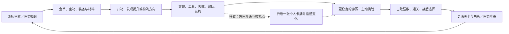

# 《霞客行》玩法策划：核心循环、构筑与渐进引导

日期：2026-09-16。关联：[程序交接](01-programmer-architecture.md)、[完整待办与验收](03-backlog-and-acceptance.md)。本文区分当前玩法、已确认未实现目标和建议方案；数值表不是已上线效果的替代证据。

## 1. 体验定位

玩家继续玩的主要动力是：**打开宝箱发现可用东西，围绕角色和卡牌做构筑，再看到自己的选择确实让队伍变强。** 游历提供稳定积累，挑战提供主动检验，任务的大量金币和宝箱给下一轮成长加速。

核心体验应能用一个具体例子解释：玩家看到主角打不过精英，穿上新开出的装备，再出发击败精英；随后加入伙伴，发现共享手牌中出现另一种打法，开始主动挑牌。每次增加复杂度之前，先让玩家看见上一项选择的效果。

挂机降低操作负担，构筑保留思考空间。开局不要求玩家先读懂全职业、NPC、地势、词缀、三种成长，再判断该按哪个按钮。

## 2. 三个系统分别给玩家什么

| 系统 | 玩家行为 | 主要价值 | 必须保持的边界 |
|---|---|---|---|
| 桌面游历 | 看小队前进、选择已可游历关卡、处理收益和战败 | 持续积累、掉落期待、低操作负担 | 不是手动卡牌回合；开箱／工具教学时继续 |
| 主动挑战 | 选路线节点、看意图、出牌、选战后收益 | 用构筑解决问题、获得新关资格和成长 | 进入挑战暂停游历；结束按原规则恢复 |
| 任务剧情 | 看对话、做任务、参加对应任务战、领奖 | 认识角色、获得目标感和一批成长资源 | 任务战不冒充普通关首通；胜利后要回到任务链 |

三者的连接点是队伍、装备、卡牌和收益，不是把三条进度揉成一个进度条。尤其不能让“看完任务”“游历过一轮”“挑战通关”互相替代。

## 3. 完整核心循环

### 3.1 短循环：拿到东西后立即有一件能做的事

掉落爆出→打开箱子→看清是什么→穿戴或使用工具→看见属性或效果变化。不能只在文本里告诉玩家“获得奖励”，也不能在第一箱之后接连弹出所有系统说明。

### 3.2 中循环：准备、挑战、验证

新装备或伙伴让玩家形成一个假设，例如“护甲能让我活到第二轮”；挑战里通过敌人意图和实际效果验证；成功后挑一项收益，失败则知道该补生存、输出还是卡组节奏。失败需要留下可理解的改进方向，而不是只告诉玩家战力不足。

### 3.3 长循环：形成偏好

更多角色、个人卡池、装备／宝石／套装、难度和任务提供不同组合。玩家逐渐从“更高数字”转向“这张牌适合我的打法”。后期图鉴、女主差异和新角色是拓展这一循环的内容，当前仍有明确未完成项。

## 4. 开局到 1-3 的当前规则与引导节奏

### 4.1 资格规则与引导推荐要分开

新游戏默认已将普通 1-1 记为挑战通关。因此，玩家开局可以游历／重打 1-1，也可以直接挑战 1-2；只有挑战通关 1-2 后才能游历 1-2。不能额外要求玩家先在 1-1 战败或等教学箱结束才开放挑战。

用户希望的 **1-1 主角、1-2 伙伴、1-3 NPC** 是新手学习节奏。它不意味着强制每个玩家在完全相同的秒数或关卡里做同一件事，也不禁止有经验的玩家提前准备已满足资格的伙伴槽。

| 阶段／事实 | 玩家当下目标 | 新增理解 | 当前状态 |
|---|---|---|---|
| 新档 1-1 游历 | 看主角走路打怪，打开第一箱 | 一个角色、一份掉落、一次装备提升 | 已有基础流程 |
| 普通箱工具链 | 自己打开当前箱，按需练一个工具 | 装備可以逐步加工 | 固定教学掉落与短链已接入 |
| 裸装首轮精英失败 | 找到空装备槽、穿上基础装备、再出发 | 装备改变战斗结果 | 已有专门恢复引导与游历校准 |
| 未失败／已提前穿装 | 继续游历，首次整轮成功后检查学习缺口 | 不因绕过失败而漏掉属性和卡组认知 | 完整属性／卡组保底仍待补 |
| 去 1-2 前后 | 购买伙伴槽天赋→点编队→选择伙伴入队 | 队伍可增加一个玩法来源 | 槽位及接力已有实现，专属玩法课仍待重做 |
| 第一次实际点怪 | 完成一次攻击，理解气力和敌我回合 | 从游历转入手动卡牌战斗 | 已有首次战斗短链，可发生在 1-2 |
| 挑战通关 1-2，进入 1-3 阶段 | 打开主线并认识首个 NPC | 任务、战后对白、领奖与 NPC 入队 | 主线／槽位已有接入 |
| S00-02 报酬实际领取后 | NPC 槽天赋→编队→月白入队 | 第二个可选队员来源 | 已有实现；角色命名显示需统一核对 |

伙伴与 NPC 槽当前各花 200 金币解锁。未开放入口只显示锁图标，不把内部条件说明铺满界面。购买后应直接引导编队图标，不能让玩家付完钱后自行寻找下一步。

出战可以是主角单人、主角＋伙伴、主角＋NPC、三人；伙伴和 NPC 后续可卸下。主角的基础可玩性不能依赖强制凑满三人。

### 4.2 首轮装备体验

当前游历校准：裸装主角 100 气血／15 攻击，可过前四波普通怪，在第 5 波精英失败；穿齐六件基础装后 158 气血／21 攻击，可以完成两波精英和 Boss，整轮七波结束。基础装基础属性乘 2，普通 1-1 敌人生命比例校准为 50%。

这一设计的目的不是强迫每人必败，而是让装备提升有足够明显的前后差异。提前穿装备顺利过关是合法路径；缺失的属性查看和卡组学习应在自然时点补上，不为触发教程而卸下装备或制造失败。

## 5. 六个教学箱：把功能藏在普通收获里

玩家看见的是普通宝箱和正常掉落。前几个箱子内部固定配套资源，逐只接续；不使用独立“教学箱商店”，也不出现“完成这一课再给下一只”的文案。

| 次序 | 教会什么 | 玩家做的事 | 结束／让路条件 |
|---|---|---|---|
| 1 | 穿戴 | 开箱，穿上可用武器／装备 | 实际穿戴成功；已有更好装备不强迫替换 |
| 2 | 镶嵌 | 查看孔位，选择配套宝石并镶入 | 实际镶嵌结果可见 |
| 3 | 强化 | 强化一次，鼠标悬停该装备查看强化结果 | 看完真实属性后关闭；不再另开假比较面板 |
| 4 | 重铸 | 用配套资源认识重铸入口与结果 | 按现有操作结果推进，展示本次变化 |
| 5 | 分解 | 看懂可选物品和可获得材料 | 可以选择不分解，关闭即可继续 |
| 6 | 合成 | 触发时给配套物品及剩余 8 个普通箱，让玩家点自动填入 | 不代点最终合成；可关闭、不强制消耗 |

第六段按九件物品的演示需求准备配套资源，但真实可用格与堆叠必须由背包规则检查，不能把“发八只箱”直接当作“八格空位已经具备”。若容量阻挡，应接存放／待领取策略，不能吞奖励。

开启规则：有固定教学掉落时先开它；右键批开只处理本次点击开始时已有的箱集合，新发下一只不会被同一次批开连续吞掉。游历在整个过程继续，只有挑战等既有互斥行为会暂停它。

## 6. 第一次真实战斗：只教当下能验证的操作

触发点是第一次普通挑战中，玩家成功点怪、进入 BattleBoard 且手牌可操作。不是“选择了 1-1”，也不是“任务文字提到战斗”。

### 6.1 同一场战斗中的顺序

1. 首手确保有用于讲解的攻击牌，先看懂并打出一次攻击。
2. 指出气力消耗与剩余气力，然后让玩家结束第一回合。
3. 首回合暂不抽主角治疗／护甲牌；敌方行动后，下一手确保支持牌可用。
4. 第二回合优先介绍治疗，随后使用护甲牌，悬停真实护甲状态图标，最后介绍自动按钮。

第二回合的治疗／护甲提示不能被“上一段未点过结束回合提示”的记录卡住，再要求先结束当前回合。小提示关闭只收起这一段，不应停用整场后续教学。

### 6.2 完成只认结果

- 玩家用别的卡造成了有效攻击结算，攻击目标可以跳过。
- 用别的卡产生实际有效治疗，治疗目标可以跳过；满血空放不能伪装成已见过回血。
- 用别的卡实际生成护甲，产甲目标可以跳过；护甲图标的查看仍需对应的实际查看行为。
- 自定义卡组缺教学牌时仅本场补齐，永久选牌不变。
- 快速击杀时正常获胜，不扣住结算强迫再挨打；未完成项在下次适合的真实战斗续接。

基础战斗教学已有接入；主角和各伙伴的专属玩法教学当前点击不了，必须另行修复，不能把两者合并报完成。

## 7. 战斗与构筑的策略空间

### 7.1 基础选择

队伍共享手牌、共享气力，角色保留自身属性、状态及卡牌来源。每回合的主要问题是：先处理哪个威胁、是否投入气力防御／治疗、用哪位角色的牌、何时结束回合。

怪物意图提供下一步压力，让玩家能够作出有理由的选择。预告与实际结算应一致；活动意图卡要在前景看清，灼烧等行动后代价要通过怪物扣血和状态反馈体现。

### 7.2 不同角色为什么值得搭配

以下是现有职业机制的策划解释，不是所有专属教程已完成的声明。

| 来源／职业 | 核心决策方向 | 教学应先让玩家看到什么 |
|---|---|---|
| 主角 | 提供基本进攻、生存与通用衔接 | 攻击、治疗、护甲各一次有用结果 |
| 刀客 | 围绕出牌顺序、首尾条件组织收益 | 同一张牌在合适顺序下多出什么收益 |
| 守卫 | 经营护甲和相关保护／反击收益 | 产甲后如何承受或转化下一次压力 |
| 药师 | 经营治疗、生命变化与药效 | 先建立条件，再兑现一次可见收益 |
| 弓手 | 累积蓄力，在适合时机释放重箭 | 储备与释放之间的取舍 |
| 法师 | 围绕不同法术分支、任务／资源机制组织连贯操作 | 只演示当前流派的一条短链 |
| 阵师 | 用地势切换组织后续牌的收益 | 先换场，再看到一张牌因此获益 |
| NPC | 用少量特色牌改变队伍衔接 | 新加入 NPC 的一项具体作用 |

卡组不是“看到新牌全部塞进去”。主角基础携带 8 张，伙伴 5 张，NPC 3 张；玩家需要决定哪些效果出现得更稳定、哪些牌会争用气力。Boss 卡槽和战后成长另行叠加，不能隐藏它们对抽牌密度的影响。

### 7.3 卡组编辑教学仍需补齐

看过卡组页不等于会编辑。建议短链：打开对应角色卡组→调整一个合法候选→点击应用。实际应用成功才算操作完成，未应用草稿不算；玩家可保留默认构筑，不强迫为了教程换掉更好的牌。

自然时点是经历一次挑战、解锁新候选牌或主动打开卡组。遗漏时在下一次有合法候选的访问／挑战准备阶段补，不把首通出口变成一长串必须完成的课程。

## 8. 战后奖励、宝箱与成长经济

### 8.1 三种收获承担不同功能

| 收获 | 策划目的 | 展示要求 |
|---|---|---|
| 游历小额持续掉落 | 维持正在积累的感受 | 从死亡怪物爆出，飞到实际入口；收起界面不刷屏 |
| 任务大批金币／箱子 | 支持一轮明显的构筑调整和开箱 | 大图标、精确数量、领取反馈到真实资源位置 |
| 战后候选成长 | 给一次主动选择，让当前玩法继续分化 | 看清选择改变哪张牌／哪种资源，不只显示品质颜色 |

普通、精英、Boss 的候选池不同；目前有卡牌品质提升、遗物、Boss 卡、气力上限和抽牌提升。具体池耗尽回退沿当前规则，不在本案凭空补概率或定价。

任务奖很多金币和箱子是为了支持构筑和开箱循环。奖励展示必须回答“拿到了什么、多少、在哪里能用”，否则数字再大也容易只是一段跳过的文字。

### 8.2 装备与工具的长期意义

装备提供直观强度，宝石／词缀／套装为构筑提供方向。合成、强化、重铸、镶嵌、分解用于处理掉落并继续追求更适合的配置。各工具的实际消耗和产出应查当前总表／规则，不把未实装的经济方案写成当前收入。

教学阶段提供固定配套物资来避免无材料可练；后续恢复普通随机掉落。随机惊喜和稳定教学各自承担不同职责，不需让玩家知道后台如何分配课程箱。

### 8.3 爽点验收

- 开箱前知道可以获得成长机会；开箱后看得清新物品。
- 用完装备／工具后能对比或观察真实属性变化。
- 回到游历或挑战，可以看到更快击杀、少受伤或某条卡牌配合生效。
- 一轮收益结束后，玩家能说出下一件想做的事，例如试伙伴、换一张牌、合一件装备。

留存、平均开箱时长、首次退出原因等目前不在本案声称已有统计。建议后续记录首次开箱、首次穿戴、精英失败／击败、首次挑战、编队提交、引导关闭与补回等事件，用实际观察调整节奏。

## 9. 技能点升级卡牌：已确认待做的完整闭环

**已确认目标**：角色升级后获得技能点，花费点数升级角色卡牌，卡牌效果逐级增加；卡组按钮显示未分配点数提示；角色升级时引导玩家升级一张卡牌；每张牌能查看 1–3 级及每种品质解锁的内容。

当前已有战后卡牌升品质，但没有交付这条技能点 UX 与逻辑。本次不虚构每级发几点、升级花几点、能否洗点。

### 9.1 必须先分清三个维度

| 维度 | 要回答的问题 | 状态 |
|---|---|---|
| 角色等级 | 什么时候获得点数，属于哪位角色 | 角色成长已有；发点规则与接线待做 |
| 卡牌等级 1／2／3 | 投入技能点后，这张牌具体提高什么 | 逐级效果与 UI 待做 |
| 卡牌品质 | 当前品质解锁哪些功能，怎样与卡等级叠加 | 现有 Common／Rare／Epic；新功能表待改、关系待定 |

建议采用独立维度：品质定义功能门槛，等级定义该功能下的成长，再生成一份实际有效卡定义供战斗和 Tooltip 共用。若最终选择品质即等级的合并方案，应明确改写现有奖励和迁移语义；不能在文案里混叫，代码里又独立叠算。

### 9.2 推荐操作流（待实现）

角色实际升级→发点成功→记录待提示→安全时点高亮该角色卡组按钮→玩家打开→选一张可升级牌→看“当前／下一级／消耗”→点击升级→点数扣除、效果提交并保存→同页展示变化。

每一小段只要求一到两步。若升级发生在战斗结算中，先让结算完成，不在选牌或演出中抢输入；回来后定位真正获得点数的角色。多名角色升级可保留各自待办，不连续弹一串窗口。

未分配点数红点由真实点数状态驱动，不能打开卡组就消失。若角色有点但所有卡已满级，应保留余额说明并避免引导到不可用按钮；红点最终显示策略在规格阶段统一。

### 9.3 每张牌需要的策划表

| 必备列 | 填写要求 |
|---|---|
| CardId／角色来源／卡名 | 使用稳定 ID，区分同名不同角色 |
| 品质及功能门槛 | 每个品质新增或开放什么；没有新增时明确写无 |
| 1 级、2 级、3 级效果 | 基础伤害／治疗／护甲、状态、段数、目标、条件分别填写 |
| 升级花费及条件 | 1→2、2→3 的点数和前置；未定先标待定 |
| 实际显示文本 | 短主文案与详细说明；下一等级只突出变化项 |
| 与战后升品质关系 | 是否叠加、作用顺序、上限及兼容旧档 |

上表是填表规格，不是已经更新了现有 Excel。逐卡内容和数值仍列为未完成。

## 10. 后续引导的自然时点和保底

以下为待补的接入设计；完成状态以待办表为准。

| 学习目标 | 自然触发 | 关闭／错过后的补触发 | 成功依据 |
|---|---|---|---|
| 穿戴后看角色属性 | 一轮穿戴结束、鼠标无拖拽 | 首次游历整轮成功或下一次背包访问 | 实际进入属性显示；不是强化 Tooltip 代替 |
| 卡组编辑 | 有合法新候选，挑战后回桌面 | 下一次卡组访问／出发准备 | 合法配置被玩家应用 |
| 技能点升级 | 某角色真实升级并获得可用点 | 下次该角色卡组访问／桌面空闲 | 实际升级一张牌成功 |
| 主角／伙伴玩法 | 玩家主动点专属教程，或首次具备对应作用条件 | 教程入口保持可点击，适合时轻提示 | 当前机制的实际结果；需要重做入口链 |
| 仓库 | **角色物品背包满**，尚未完成仓库学习 | 下次开箱／领取因容量阻挡，或进入背包 | 打开仓库后由玩家点“放入”，真实移动成功 |
| 背包商店 | 首次打开背包商店或有合理购买需求 | 下一次商店访问 | 找到入口、看懂商品和花费；是否必须购买待定 |
| 音量开关 | 初次查看音频控制 | 下次打开设置 | 玩家操作开关，实际声音状态一致 |
| 音效／BGM 调节 | 初次进入可用音频设置 | 再次进入设置 | 两项独立变化且能保存 |
| 置顶／取消置顶 | 首次与桌面窗口交互或主动打开说明 | 下次点相关入口 | 用户改变置顶状态，按钮与实际窗口一致 |

满包应基于权威物理占用：堆叠数量不等于格子数；仓库也满时要给可返回路径，不强迫分解或卡在“放入”。角色仓库本案暂按物品仓库理解，伙伴名单仓库若另有需求需独立设计。

### 调度建议

业务结算与玩家当前操作优先，其次是当下遇到的容量／资源阻碍，再是本次新解锁内容，最后才是旧知识补课和窗口设置。一次只显示一段；玩家明确继续挑战时允许出发，不轮流补完整本说明书。

引导完成依据要分清“读过”“做过”“实际达成”。自动开页面不是玩家已经掌握，自动战斗也不等于玩家手动完成操作。教程关闭应保留可重进的入口。

## 11. 表现设计与后续资源

### 11.1 已确认的视觉语言

金色圆形方孔铜钱、宝石和宝箱保持统一画风。掉落从怪物身上爆出，金币在挂机条的 Tab 吸收消失，条内不新增常驻金币数字。任务与战后奖励用同样资源配齐图标和数量，领取后飞向实际入口。这部分已获用户验收。

### 11.2 待做的感知节点

- 游历遇到精英或 Boss：横向大字 **“强敌”／“warning”**。
- 击败 Boss：横向大字 **“清剿”／“clear”**。
- 所有角色动画和卡面更新；角色背包展示对应角色 idle。

建议横幅在真实遭遇／死亡事件触发一次，不因 UI 重建反复播放；不暂停游历，不覆盖关键按钮。折叠状态如何提示、中文／英文按当前语言切换还是双语同屏、具体时长与音效，需要在资源接入时定稿。

### 11.3 女主差异（资源和设计均未完成）

要求：女主 **30 张主角卡**，玩法与男主拉开差异；女主 **61 张剧情插图**，切换主角后使用对应剧情显示。

建议先做双方对照：共有基础能力、各自核心机制、构筑优势、代价、与伙伴的配合，再定 30 张卡，不能只换名和换图。为避免突然扩大范围，女主是否改变对白文本／分支结局尚不默认包含；当前明确要求是对应剧情视觉随主角切换。

程序需以主角身份＋剧情节点解析插图，策划／美术提供 61 项映射及缺图回退规则，不能依赖当前界面里残留的上一位主角贴图。

## 12. 图鉴与大后期方向

### 12.1 图鉴系统：已确认待做

**伙伴页签**：伙伴升到 **20 级**解锁立绘，可在图鉴查看；需生成魅力立绘。需要明确是按伙伴模板、外观还是实例解锁，以及已满 20 级旧档如何补记。建议永久收藏不随卸下伙伴而消失，正式规则仍需定稿。

**怪物页签**：实际遭遇后解锁，可查看怪物技能／意图卡；按一、二、三阶段分组。单阶段怪物不展示虚假的后续牌。是首次遭遇即开放全部阶段，还是遭遇相应阶段才开放该阶段细节，用户尚未指定，列为待定。

既有遭遇记录或目录可作为基础，但不代表所需的两页签图鉴已经完成。

### 12.2 大后期独立立项

| 方向 | 当前要求 | 进入制作前要解决的问题 |
|---|---|---|
| 局域网对战 | 穿装备／不穿装备两种模式 | 权威端、卡池／成长一致性、断线、双方行动结构、装备归一化 |
| 服务器异步匹配 | 类大巴扎玩法 | 上传的是阵容快照还是行动策略、规则版本、服务端模拟、匹配与结果可信性 |
| UGC | 玩家上传卡图、抠图、放置到挂机背景层 | 资源规格、裁切透明边、层级放置、保存、包体／网络分发和内容边界 |
| DLC | 新角色和 NPC 等 | 稳定内容 ID、缺 DLC 存档兼容、角色／卡／叙事资源注册与平衡 |

这些方向现在不占用新手流程入口，也不对当前交付承诺完整架构与上线时间。分别完成设计和技术验证后再排期。

## 13. 本案的完成标准与当前缺口

设计希望玩家依次能回答：“我在积累什么”“装备怎么让我变强”“为何加入这个伙伴”“这张牌什么时候用”“这次奖励能支持什么选择”。每一项必须由真实游玩结果支持。

目前已经有桌面游历、挑战、主线、装备工具、分步槽位、教学箱、基础首战与奖励表现。**还没有做完覆盖所有内容的自然教学，也没有完成技能点升级闭环、专属玩法教学修复、仓库排序／满包教学、声音设置及图鉴等。** 全部明细见 [未完成事项与验收](03-backlog-and-acceptance.md)，不能用本案写完代替功能做完。
