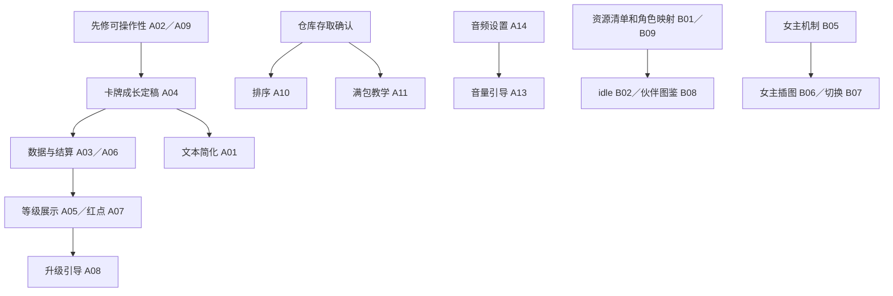

# 《霞客行》未完成事项、实施顺序与验收

更新：2026-09-16。来源：用户本次逐项说明，以及前文仍未完成的自然引导要求。关联：[程序案](01-programmer-architecture.md)、[玩法案](02-gameplay-design.md)、[阅读入口](README.md)。

**本表是未完成清单，不是完成报告。** 有底层类、旧教程、静态稿或文档，不代表用户要求的实际操作闭环完成。本轮只写文档，以下项目没有因本次整理而变成“已做”。优先级与分批顺序是建议，不是已承诺排期。

## 1. 本次用户需求逐项映射

| ID | 用户要求 | 当前交付状态 |
|---|---|---|
| A01 | 卡牌 Tooltip 文本简化 | 未做 |
| A02 | 卡组页 Shift 点击多次后卡住 | 未修复 |
| A03 | 角色卡牌花费技能点升级，卡牌效果逐步增加 | 未做；现有战后升品质不能替代 |
| A04 | 修改“每个卡牌品质解锁什么功能”的表格 | 未改 |
| A05 | 详细展示卡牌 1–3 级效果 | 未做 |
| A06 | 角色升级获得技能点、花费升级点升级卡牌的 UX 与逻辑 | 未做 |
| A07 | 角色有未分配技能点时，卡组按钮提示红点 | 未做 |
| A08 | 角色触发升级时，开启指引玩家升级一张卡牌 | 未做 |
| A09 | 主角与各伙伴角色玩法引导目前点击不了，重新做 | 待修复／重做 |
| A10 | 角色仓库新增排序按钮 | 未做 |
| A11 | 角色背包满时提示并打开仓库，引导玩家点“放入” | 未做 |
| A12 | 背包界面的商店引导 | 未做 |
| A13 | 音量开关引导 | 未做 |
| A14 | 音效音量调节、BGM 音量调节设置 | 未做完整交付 |
| A15 | 置顶／取消置顶按钮引导 | 未做 |
| B01 | 所有角色动画和卡面更新 | 后续待做，资源未配齐 |
| B02 | 角色背包面板播放对应角色 idle 动画 | 后续待做，资源未配齐 |
| B03 | 挂机条精英／Boss 遭遇横幅：“强敌”／“warning”横屏大字 | 后续待做 |
| B04 | 击败 Boss 显示：“清剿”／“clear”大字 | 后续待做 |
| B05 | 女主 30 张主角卡，与男主玩法有差异 | 待设计／实现／配资源 |
| B06 | 女主 61 张剧情插图生成 | 待做 |
| B07 | 切换主角时切换对应剧情显示 | 待做 |
| B08 | 图鉴伙伴页签：伙伴 20 级解锁立绘，图鉴可查看 | 图鉴目标未做 |
| B09 | 伙伴魅力立绘生成 | 待做 |
| B10 | 图鉴怪物页签：遭遇后解锁、查看技能卡、分一／二／三阶段 | 图鉴目标未做 |
| C01 | 穿装备／不穿装备的局域网联机对战 | 大后期，未做 |
| C02 | 类大巴扎服务器异步匹配玩法 | 大后期，未做 |
| C03 | UGC 玩家上传卡图、抠图、放置在挂机背景层 | 大后期，未做 |
| C04 | DLC 新增角色和 NPC 等 | 大后期，未做 |

“角色仓库”暂按当前角色背包旁的**物品仓库**对接。若实际指伙伴角色名单仓库，需要先调整 A10／A11 范围；物品格子满与伙伴人数满不是同一条件。

## 2. 建议实施顺序与依赖

| 批次 | 交付目标 | 本批结束时应看到的结果 |
|---|---|---|
| 0：恢复可用 | A02、A09 的入口／输入阻塞 | 卡组可连续编辑；主角和每位伙伴可实际进入课程并退出 |
| 1：成长闭环 | A03–A08，协同 A01 | 一位角色升级发点，玩家看懂并升级一张牌，保存后战斗生效 |
| 2：桌面操作教学 | A10–A15，加 D01／D02 | 满包能存放，商店／音频／置顶可理解，遗漏基础课可自然补回 |
| 3：表现与收集 | B01–B04、B08–B10 | 动画映射齐全、强敌／清剿事件反馈、图鉴两页签可用 |
| 4：女主完整体验 | B05–B07 | 30 张差异牌与 61 图映射交付，切主角不串资源 |
| 5：后期玩法 | C01–C04 独立立项 | 每项先有可审查规则与技术原型，再决定正式制作 |

资源制作可以与功能开发并行安排，但验收要等资源和真实业务接齐。本表没有要求创建新的并行任务或变更工程工作方式。

## 3. A 类：当前功能与引导缺口

### A01 卡牌 Tooltip 文本简化

- **目标**：第一眼读懂这张牌能做什么，详细说明仍保留条件、目标、效果与必要规则。
- **交付物**：逐卡短文案规范、代表性卡试稿、完整文本差异表、中文／英文同步结果。
- **建议结构**：主效果一段；条件收益一段；关键词详细说明按需展开。只写当前生效值，下一等级变化放专门比较区。
- **触点**：`GameXXKCardText`、`GameXXKCardTooltipWidget`、本地化；参考旧文本评审稿，但按当前 173 张活动目录核对。
- **验收**：攻击、治疗、护甲、多段、条件触发、地势和任务型卡均有样例；没有因简化丢失关键限制；卡组、战斗和奖励预览同一数值口径；长英文不溢出。

### A02 卡组页多次 Shift 点击后卡住

- **状态**：用户报告未修复，根因尚未定；不能仅关掉 Shift 功能就算完成。
- **交付物**：可复现操作序列、输入／回调证据、修复和回归记录。
- **排查**：卡牌选择与应用、Shift 状态、重复点击、界面重建、指针捕获、回调重入、已销毁 Widget 引用。
- **验收**：按复现序列及连续快速操作后，仍可选／取消／应用／关闭／重开；主角、伙伴、NPC 入口均不串草稿；没有非法携带数量、丢牌或重复应用。保留未应用草稿原有语义。

### A03 逐级卡牌效果与技能点消费规则

- **目标**：升级真正改变该角色卡牌的效果，并非只改角标。
- **依赖**：A04 的品质／等级关系与成长数值定稿。
- **交付物**：角色卡牌进度记录、升级校验及原子事务、有效卡定义生成、战斗／预览／Tooltip 共用取值。
- **验收**：1→2、2→3 分别得到对应效果；满级、点数不足、非本角色牌等失败无扣点；重复点击只提交合法次数；关闭／重登保留结果；同模板不同伙伴的升级不会串到另一个实例。

### A04 品质功能表修改

- **交付物**：实际更新 [卡牌设计总表所在目录](../design/2026-09-04-project-design-tables/README.md) 中的对应表，不能只在新文档写一张空模板。
- **必填**：CardId、角色来源、每个品质解锁功能、1／2／3 级逐项效果、升级成本、前置、与战后升品质关系、文本显示规则。
- **待定**：品质和等级独立还是合并；品质先算还是等级先算；旧有升品质权益如何保留。
- **验收**：活动卡范围完整、稳定 ID 无重复；不适用项明确标出；每个新增功能在规则消费者中有映射；原表未涉及页和人工校准不被覆盖。

### A05 卡牌 1–3 级详细展示

- **目标**：不用先花点数，玩家就知道当前、下一等级和满级是什么。
- **交付物**：1／2／3 级详情，当前等级标记，未满足前置，下一等级变化强调。
- **验收**：费用、段数、目标数、状态数值和功能变化均按实际定义展示；与当前品质组合一致；达到 3 级无错误的下一等级按钮；不用虚构常规乘数代替逐卡设计。

### A06 角色升级发点与升级卡牌 UX／保存

- **目标**：把经验→角色升级→点数到账→选牌升级连起来。
- **交付物**：发点时点、点数归属、跨多级结算、UI 提示、确认升级、保存迁移和失败恢复。
- **待定**：每级发点数，升级消耗，角色等级限制，是否支持重置／退款，旧档补点公式，NPC 是否同样参与。
- **验收**：主角与伙伴分别归属正确；同次结算多人升级不串点；跨多级不漏发；重复读取结算不重复发；保存失败不出现点数／等级半提交；永久卡组与当前战斗快照关系明确。

### A07 未分配技能点红点

- **依赖**：A06 的权威点数状态。
- **交付物**：卡组按钮红点，切角色后的更新；角色拥有点数但不能再升级时的余额说明。
- **验收**：有未分配技能点可见；开页不自动清掉；实际用完点数才按规则消失；重登与切页一致；多人状态不会只监听主角。满级卡已无可升级项时的提示规则需统一，不指向失效操作。

### A08 角色升级时教升级一张牌

- **触发**：真实角色升级及发点成功；记录待引导，在当前战斗／结算／拖拽结束后展示。
- **两步一段**：点该角色卡组→选牌；看变化与消耗→玩家点升级；看已生效结果→结束。
- **保底**：关闭后在下次该角色卡组访问或安全桌面时点继续；玩家已自行成功升级一张牌则认可结果。
- **验收**：不代点、不强行选定特定牌；点数不足或全满级时不卡死；多角色升级不连续抢焦点；完成证据来自实际升级事务。

### A09 主角与全部伙伴专属玩法引导重做

- **范围**：用户报告的点击不可用问题，加每个角色课程的进入、目标、完成、退出链；不是仅修改一段教程文案。
- **触点**：Academy 目录／规则／Subsystem、工作台课程入口、引导输入层、真实战斗目标注册。
- **交付物**：逐角色课程矩阵；每课先教一个核心机制，用实际结算验证；入口可重进。
- **验收**：主角和各伙伴均能点击开始，指定按钮真实可点；目标消失、关闭、重进都有可返回路径；不污染永久卡组／资产；基础首战教程不被重播或覆盖。

### A10 角色仓库排序按钮

- **目标**：库存多时能整理找到东西；保留现有存放和物品锁定能力。
- **建议默认**：按类别→品质→等级→稳定 ID 排序；最终排序键、升降序、空格是否压到尾部、按当前页还是整个仓库处理需定稿。
- **验收**：排序前后物品／装备实例集合和堆叠数量完全相同；装备归属、锁定、页码范围正确；选择／拖拽中不会把原下标的另一件物品拿走；重开后排序语义一致。

### A11 背包满时引导仓库“放入”

- **触发**：物品背包真实满，玩家尚未完成该知识点；按物理占用格判断，不用物品总数量判断。
- **流程**：提示容量问题→打开仓库→高亮“放入”→玩家点击→实际存放成功→结束。
- **保底与异常**：玩家忙于战斗／拖拽时排队；关闭可稍后处理；仓库也满、锁定限制或无合法候选时展示原因并允许返回；奖励不能因容量问题消失。
- **验收**：堆叠入已有格、空一格、恰好满、两边都满各一例；放入确实释放预期背包格；不强迫分解；不自动代放；同次提示关闭后不逐帧重复弹出。

### A12 背包商店引导

- **范围**：背包／工作台商店入口、查看商品与价格、理解购买位置；与局内路线商店区别。
- **建议**：首次主动进入或出现真实购买需求时高亮一到两步；是否要完成一次真实购买需定稿，不能默认强扣金币。
- **验收**：引导实际入口可点；展示正确货币、数量、是否买得起；买不起能退出；返回背包自然续接；不混用路线钱和永久金币。

### A13 音量开关引导

- **依赖**：开关有真实有效的音频行为；不能只教点图标。
- **流程**：定位音量按钮→由玩家操作→确认当前开／关状态。
- **验收**：鼠标可点，静音状态与实际声音一致，关闭教程后设置保留；不在首战出牌时抢占焦点。

### A14 音效／BGM 独立音量设置

- **交付物**：两项独立调节、保存／读取、静音配合、当前值显示；接到实际音效和 BGM 播放链。
- **待定**：数值范围、默认值、主音量是否另有总开关、切换档案时是否共享设置。
- **验收**：只调音效不改 BGM，只调 BGM 不改音效；到静音端实际无对应声音；新声音也使用当前设置；重开游戏保留；快速拖滑块无爆音／重复创建播放器。

### A15 置顶／取消置顶引导

- **交付物**：按钮用途、当前状态、一次实际操作短引导；连到真实桌面窗口。
- **验收**：置顶和取消置顶均生效，图标状态与窗口一致；课程可关闭重进；不能仅以 UI 布尔值变化作为验收，需在另一个窗口前后切换观察。

## 4. B 类：资源未齐与后续内容

### B01 全角色动画与卡面更新

- **交付物**：角色／NPC／相关卡面资产清单，来源与版本、尺寸、透明边、朝向、动作映射、缺项表。动作种类按现有消费者逐项盘点，不凭空要求所有角色相同动作数量。
- **验收**：每个实际可选角色身份与卡面一致；动作无缺帧／错误裁边；不覆盖未经确认的手调资产；背包、编队、游历、战斗各入口检查映射与缓存。

### B02 背包角色 idle 动画

- **依赖**：B01 对应 idle 资源齐全。
- **验收**：主角／伙伴／NPC 切换后显示当前对象；快速切换不被旧异步回调覆盖；面板关闭后不继续重复创建动画／计时器；缺资源有既定回退。

### B03 强敌横幅

- **触发**：游历真实进入精英或 Boss 遭遇。
- **文案**：中文“**强敌**”，英文“**warning**”，横向大字效果。
- **待定**：语言切换还是中英同屏、停留时间、音效、折叠状态表现。
- **验收**：普通怪不触发；同次遭遇只播一次；不暂停游历，不阻挡箱子和 Tab；UI 重建不重复播；中文／英文均可读。

### B04 Boss 击败清剿横幅

- **触发**：真实 Boss 击败结果；先按用户当前挂机条语境实现，是否同步局内另行确定。
- **文案**：中文“**清剿**”，英文“**clear**”。
- **验收**：未胜利、撤退、普通击杀不误播；奖励入账次数不受横幅影响；与掉落、任务弹窗不互相遮挡；重复读结果不反复播。

### B05 女主 30 张差异化主角牌

- **交付物**：男／女主机制对照、30 张逐卡定义、品质和等级表、费用／目标／条件、构筑样例、文本与卡面映射。
- **验收**：确实 30 张且有稳定 ID；差异体现在操作与构筑，不仅数值或名字；攻击／生存／资源曲线可用；与伙伴和 NPC 不产生无法操作的组合；跟随最终技能点规范。
- **待定**：女主解锁方式、男女主卡池是否共享、切换后升级点与选牌如何保留。不得直接用女主 30 张要求去替换男主当前目录总数。

### B06 女主 61 张剧情插图

- **交付物**：61 项剧情节点／场景镜头清单、生成图、审图状态、尺寸和资源映射；不是只生成 61 个无任务对应的图片文件。
- **验收**：61 项齐全、角色一致、文本留白与画面范围符合界面；重复／漏节点可定位；最终资源经过确认后再导入，未审稿不能算完成。

### B07 主角切换后的剧情显示

- **依赖**：B06 映射；与主角身份和剧情节点关联。
- **验收**：新进剧情、回看对白、战后返回任务、读档恢复均使用当前主角对应插图；快速切换无串图；缺图时按明确回退；不擅自重置剧情或重复领奖。
- **边界**：当前明确是切换对应剧情显示；对白重写、性别专属分支或结局不默认包含，需要另行定稿。

### B08 伙伴图鉴页签与 20 级解锁

- **要求**：伙伴升级到 20 级解锁立绘，在图鉴查看。
- **交付物**：伙伴页签、锁定／已解锁显示、查看入口、永久解锁记录与旧档补记。
- **待定**：按模板／外观／实例解锁；遣散后是否永久保留收藏。
- **验收**：19→20 级只解锁一次；已 ≥20 级旧档按政策补记；未达条件不提前显示；切伙伴不串图；解锁入口确实可以打开立绘。

### B09 伙伴魅力立绘

- **交付物**：目标伙伴名单、每位数量、风格及画幅规格、审稿和最终资源；与 B08 的解锁键逐项对应。
- **待定**：“魅力立绘”的具体构图／风格和资源数量。
- **验收**：所有已声明可解锁对象都有对应成品，不以普通头像临时代替后宣称资源完成。

### B10 怪物图鉴页签与阶段分类

- **要求**：真实遭遇后解锁；可查看怪物技能／意图卡，按一、二、三阶段分类。
- **交付物**：遭遇事实记录、页签、怪物详情、阶段分组、意图卡详情与未解锁状态。
- **待定**：初遇是否开放全部阶段详情，或仅开放实际见过阶段；旧档遭遇记录迁移。
- **验收**：打开图鉴本身不制造遭遇；同怪不同阶段准确归类；单阶段怪不伪造二／三阶段；卡牌文本来自当前敌人定义；旧怪物目录存在不等于本项已完成。

## 5. C 类：大后期独立立项

### C01 穿装备／不穿装备局域网联机对战

第一份交付应是双方战斗规则和联网协议案：谁是权威、组队／回合结构、哪些成长计入、无装备模式具体屏蔽哪些属性、断线恢复和版本校验。原型验收须真实两端连接，双方状态和结算一致；无装备模式不删除玩家本地装备。当前未实现，不纳入本轮单机补课交付。

### C02 类大巴扎服务器异步匹配

先确定上传快照、匹配条件、阵容执行策略、服务端结算、回放和版本兼容，随后评估成本。不能把“把本地战斗结果上传”称为完整异步匹配。原型验收包括两份不同玩家快照匹配、可复现战斗、结果幂等提交、规则版本不同的处理。

### C03 UGC 上传卡图、抠图与挂机背景放置

范围必须同时覆盖：玩家选图／上传、抠图生成透明资源、预览、在挂机背景层放置和保存。先定本地还是服务端存储、图片规格、锚点／缩放／层级、撤销删除、分享范围和资源限制。验收实际图片透明边可用，遮挡层次正确，重开恢复，不挡关键操作，失败不丢原图。

### C04 DLC 新角色和 NPC

先定内容注册、所有权检查、稳定 ID 与缺 DLC 存档兼容。每个角色包含卡牌、数值、动画、卡面、文本、剧情／任务接入和引导，不能只列角色名。验收购买／启用范围按未来发行方案测试，单机基础流程不因缺少 DLC 资源而崩溃。

## 6. 前文遗留与工程核对项（与本次用户清单分开）

| ID | 事项 | 当前判断与下一步 |
|---|---|---|
| D01 | 穿装后查看角色属性，以及未战败路径的保底 | 仍需完成自然短链；穿装后等操作结束，游历 1-1 首次成功或后续背包访问补查。不能把强化悬停等同角色属性页 |
| D02 | 正式卡组编辑教学 | 补选择／取消／应用的完整实际操作；不把打开卡组算会编辑，不因漏课禁止挑战 |
| D03 | 开发临时会话保存隔离专项复核 | 历史记录有写入观察；当前 SaveCurrentGame 调用 WriteSaveGameToSlot，后者已有保护。旧“绕过保护”原因不能直接复用，需复查标志和其他保存入口。未宣称修复 |
| D04 | 扩展敌人意图 UI 静态断言 | 另有状态图标、伤害后缀布局、Tooltip 伤害 3 条断言不符，独立查原因；不删除断言凑全绿 |
| D05 | 月白／幽白显示名口径 | 代码 ID `Npc.YueBai` 保持；核对叙事与界面显示是否统一，避免把改名当资源迁移 |
| D06 | 正式无 F10 Shipping 打包入口 | 当前脚本默认 ShippingF10；正式包流水线应明确 GameXXK Shipping 与开发包区别，并验证 F10 不可用 |
| D07 | 装备／词缀／宝石数值表与消费者差异复核 | 现有总表自带部分未接入／待定标记；接手时按当前源码重核差异，不能把设计预算当实机值 |

以上不是重新打开已经验收的奖励飞行动效。敌方行动后灼烧与活动意图前景最近已有定向修复，也不重新标成“完全未做”；仅保留实际剩余的静态 UI 检查问题。

## 7. 不应改回待做的已验收／已实现范围

- 奖励大图标、任务领取飞行、相应战斗箱子展示：**用户已验收动效**，见 [记录](../production/2026-09-16-story-return-reward-presentation.md)。
- 1-1 初始挑战通关资格、1-2 开局可挑战但未通关不可游历：近期已校正。
- 普通教学箱优先开启、逐只接续、强化悬停、分解可关闭、合成只教自动填入：已有实现。
- 基础首次实战攻击／气力／治疗／护甲／自动短链：已有实现和同场续接修复，但不替代 A09。
- 挑战期间暂停游历、可选伙伴／NPC 空槽、购买槽位后接编队：已有实现。

## 8. 每项关闭待办的标准

1. 规格中的未定参数已记录，不把临时代码常量当作用户批准值。
2. 对应业务、展示、输入、保存和引导接齐；所需资源完成审核。
3. 做与该改动相称的验证：文档只查文本；纯美术做资源与视觉检查；运行时代码冷编译并复现相关行为。
4. 记录新档、已有进度、关闭／返回、重复点击等适用情况，避免只验理想路径。
5. 更新本表状态并链接具体证据；用户需要验收的视觉交互由实际效果确认，不凭实现者文字描述关单。

本表没有把任何未实现项改成完成，也没有代替原 Excel 做逐卡数值设计。下一轮开发应从一个完整闭环开始，避免同时留下多个“按钮已出现、逻辑以后接”的半成品。
